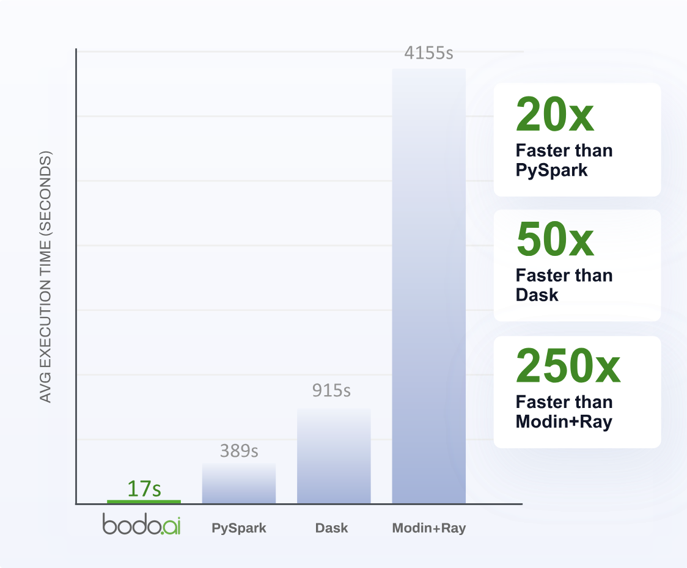

<!--
NOTE: the example in this file is covered by tests in bodo/tests/test_quickstart_docs.py. Any changes to the examples in this file should also update the corresponding unit test.
 -->


<h3 align="center">
  <a href="https://docs.bodo.ai/latest/" target="_blank"><b>Docs</b></a>
  &nbsp;&#183;&nbsp;
  <a href="https://bodocommunity.slack.com/join/shared_invite/zt-qwdc8fad-6rZ8a1RmkkJ6eOX1X__knA#/shared-invite/email" target="_blank"><b>Slack</b></a>
  &nbsp;&#183;&nbsp;
  <a href="https://www.bodo.ai/benchmarks/" target="_blank"><b>Benchmarks</b></a>
</h3>

# Bodo DataFrames: Simple Python Acceleration and Scaling for Data and AI

Bodo DataFrames is a high performance dataframe library for large scale Python data processing, AI, and ML use cases.
It functions as a drop-in replacement for Pandas while providing additional Pandas-compatible APIs for simplifying and scaling AI workloads,
a Just-In-Time (JIT) compiler for accelerating custom transformations, as well as an integrated SQL engine for extra flexibility.

<!-- TOOD: updated graph with Taxi benchmark including Bodo DataFrames Pandas API -->


Unlike traditional distributed computing frameworks, Bodo DataFrames:
- Automatically scales and accelerates Pandas workloads with a single line of code change.
- Eliminates runtime overheads common in driver-executor models by leveraging Message Passing Interface (MPI) tech for true distributed execution.


## Goals

Bodo DataFrames makes Python run much (much!) faster than it normally does!

1. **Exceptional Performance:**
Deliver HPC-grade performance and scalability for Python data workloads as if the code was written in C++/MPI, whether running on a laptop or across large cloud clusters.

2. **Easy to Use:**
Easily integrate into Python workflows— it's as simple as changing `import pandas as pd` to `import bodo.pandas as pd`.

3. **Interoperable:**
Compatible with regular Python ecosystem, and can selectively speed up only the sections of the workload that are Bodo supported.

4. **Integration with Modern Data Infrastructure:**
Provide robust support for industry-leading data platforms like Apache Iceberg and Snowflake, enabling smooth interoperability with existing ecosystems.


## Non-goals

1. *Full Python Language Support:*
We are currently focused on a targeted subset of Python used for data-intensive and computationally heavy workloads, rather than supporting the entire Python syntax and all library APIs.

2. *Non-Data Workloads:*
Prioritize applications in data engineering, data science, and AI/ML. Bodo is not designed for general-purpose use cases that are non-data-centric.

3. *Real-time:*
Bodo DataFrames, is not yet optimized for small, fast workloads (e.g., workloads with execution times of only a few seconds).


## Key Features

- Drop-in Pandas replacement, (just change the import!) with a seamless fallback to vanilla Pandas to avoid breaking existing workloads.
- Intuitive APIs for simplifying and scaling AI workloads.
- Advanced query optimization,
efficient C++ runtime,
and parallel execution using MPI to achieves best possible performance while leveraging all availible hardware.
- Streaming execution to process larger-than-memory datasets.
- Just in Time (JIT) compilation with native support for Pandas, Numpy and Scikit-learn
for accelerating custom transformations or performance-critical functions.
- High performance SQL engine that is natively integrated into Python.
- Advanced scalable I/O support for Iceberg, Snowflake, Parquet, CSV, and JSON with automatic filter pushdown and column pruning for optimized data access.

See Bodo DataFrames documentation to learn more: https://docs.bodo.ai/


## Installation

Note: Bodo DataFrames requires Python 3.9+.

Bodo DataFrames can be installed using Pip or Conda:

```bash
pip install -U bodo
```

or

```bash
conda create -n Bodo python=3.13 -c conda-forge
conda activate Bodo
conda install bodo -c conda-forge
```

Bodo DataFrames works with Linux x86, both Mac x86 and Mac ARM, and Windows right now. We will have Linux ARM support (and more) coming soon!

## Bodo DataFrames Example

Here is an example Pandas code that reads and processes a sample Parquet dataset.
Note that we replaced the typical import:
```python
import pandas as pd
```
with:
```python
import bodo.pandas as pd
```
which accelerates the following code segment by about 50-60x on a laptop.

```python
import bodo.pandas as pd
import numpy as np
import time

NUM_GROUPS = 30
NUM_ROWS = 20_000_000

df = pd.DataFrame({
    "A": np.arange(NUM_ROWS) % NUM_GROUPS,
    "B": np.arange(NUM_ROWS)
})
df.to_parquet("my_data.pq")

def computation():
    t1 = time.time()
    df = pd.read_parquet("my_data.pq")
    df["C"] = df.apply(lambda r: 0 if r.A == 0 else (r.B // r.A), axis=1)
    df.to_parquet("out.pq")
    print("Execution time:", time.time() - t1)

computation()
```

## How to Contribute

Please read our latest [project contribution guide](CONTRIBUTING.md).

## Getting involved

You can join our community and collaborate with other contributors by joining our [Slack channel](https://bodocommunity.slack.com/join/shared_invite/zt-qwdc8fad-6rZ8a1RmkkJ6eOX1X__knA#/shared-invite/email) – we’re excited to hear your ideas and help you get started!

[](https://codecov.io/github/bodo-ai/Bodo)