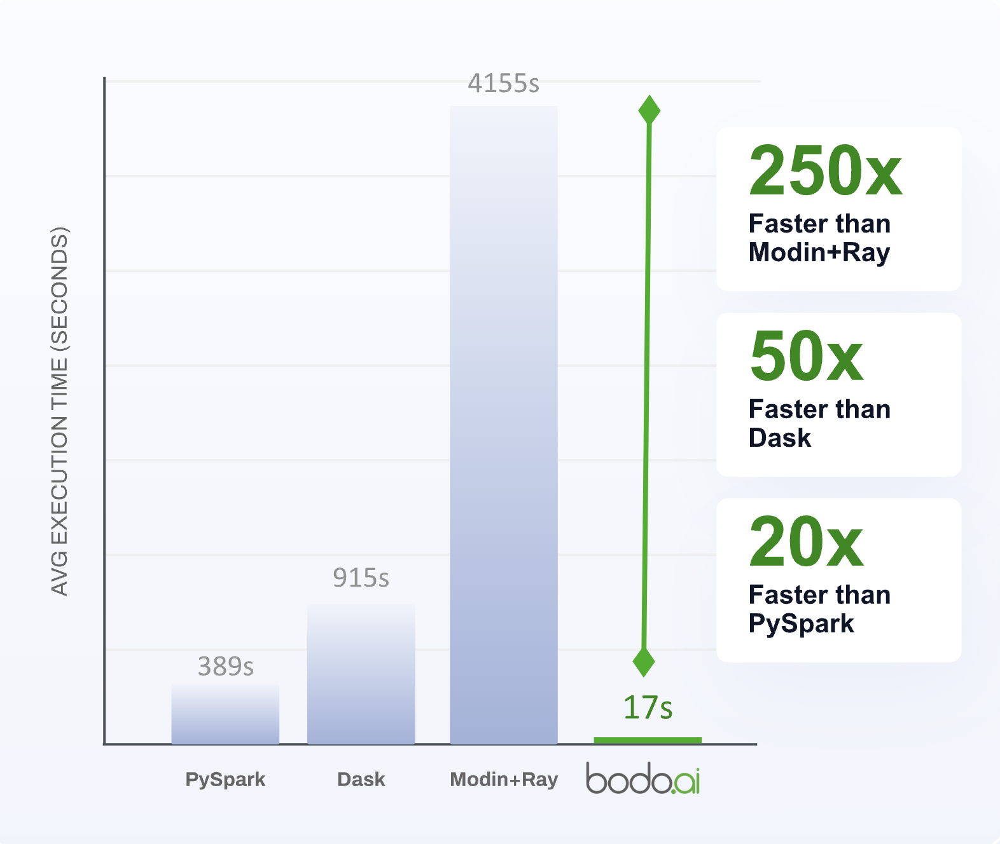

# Benchmarks

### NYC TLC For High Volume For Hire Vehicles (HVFHV)

The New York City Taxi and Limousine Commission's [For Hire Vehicle High Volume dataset](https://www.nyc.gov/site/tlc/about/tlc-trip-record-data.page) consists of over one billion trips taken by "for hire vehicles" including Uber and Lyft. For this benchmark, we adapt a typical [SQL query](https://github.com/toddwschneider/nyc-taxi-data/blob/c65ad8332a44f49770644b11576c0529b40bbc76/citibike_comparison/analysis/analysis_queries.sql#L1) into a pandas workload that reads the dataset from a public S3 bucket and calculates the average trip duration and number of trips based on features like weather conditions, pickup and dropoff location, month, and whether the trip was on a weekday. To get the weather on a given day, we use a separate dataset of [Central Park weather observations](https://github.com/toddwschneider/nyc-taxi-data/blob/c65ad8332a44f49770644b11576c0529b40bbc76/data/central_park_weather.csv). 

We compared Bodo's performance on this workload to other systems including [Dask](https://www.dask.org/), [Modin on Ray](https://docs.ray.io/en/latest/ray-more-libs/modin/index.html), and [Pyspark](https://spark.apache.org/docs/latest/api/python/index.html) and observed a speedup of 20-240x. The implementations for all of these systems can be found in [`nyc_taxi`](./nyc_taxi/).

#### Comparison of Bodo vs Other systems



In all systems, the number of physical cores allocated for workers remained constant. For Pyspark, Dask, and Modin-Ray, we used `4 x r6i.16xlarge` instances to prevent out of memory issues while Bodo was able to run on a `4 x c6i.16large` cluster, leading to even higher cost savings.

## Local Benchmarks

You can start to see the benefits of using Bodo from your laptop by running the benchmarks found in [`local`](./local/). To set up, install the additional packages using pip in your pixi shell:

``` shell
pixi shell
pip install dask
pip install "modin[all]"
pip install pyspark
```
Then run the benchmarks!

``` shell
python bodo_nyc_taxi_precipitation.py
python dask_nyc_taxi_precipitation.py
python modin_nyc_taxi_precipitation.py
python spark_nyc_taxi_precipitation.py
```

Results from the local benchmarks were collected on an Apple M2 Mac which has 16 GB of memory and 10 cores.

### NYC Taxi/HVFHV

We used a smaller subset of the [For Hire Vehicle High Volume dataset](https://www.nyc.gov/site/tlc/about/tlc-trip-record-data.page) to allow the workload to run locally. Even at this smaller scale, Bodo shows a modest improvement over the next best system (Dask). 

| System    | Execution Time (s)  |
|-------------|-------------|
| **Bodo** | 5.65 |
| Pyspark | 55.87 |
| Dask | 10.04 |
| Modin+Ray | 34.45 |

To see an even bigger difference, try increasing the number of rows read by replacing the `fhvhv_dataset` variable in the scripts with a different parquet file from the same bucket e.g. `s3://bodo-example-data/nyc-taxi/fhvhv_tripdata/fhvhv_tripdata_2019-02.parquet`. On this size (~20 million rows), Dask runs out of memory whereas Bodo continue to run. 