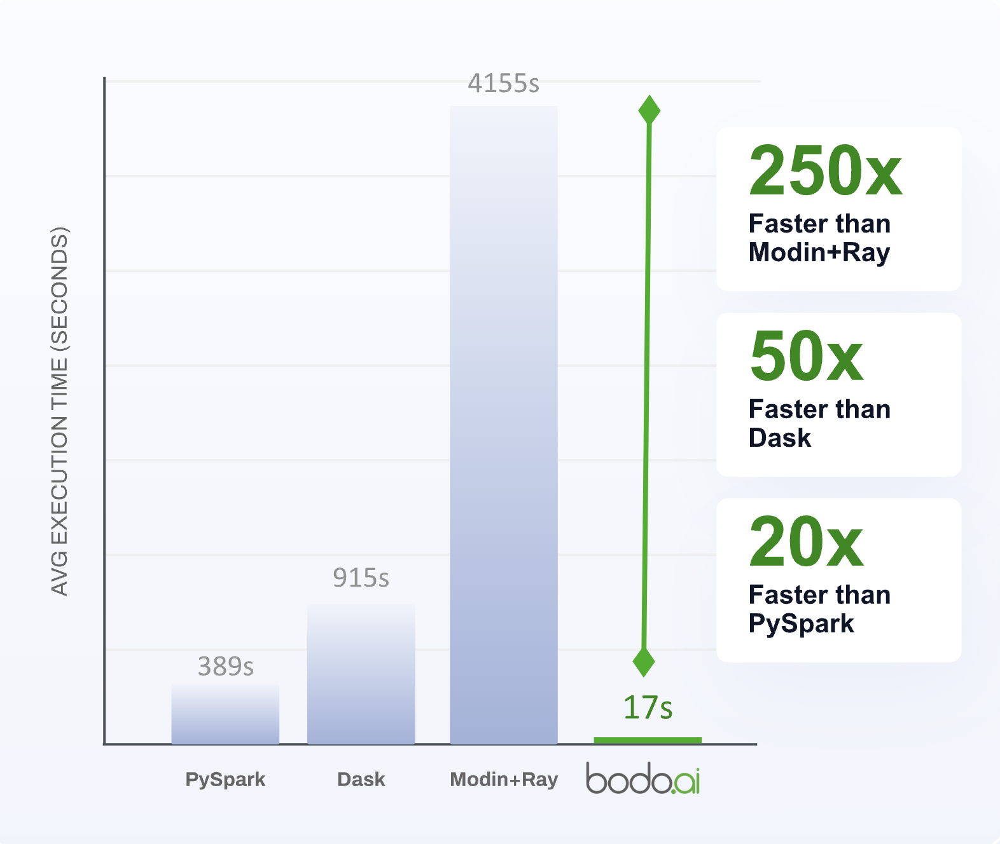
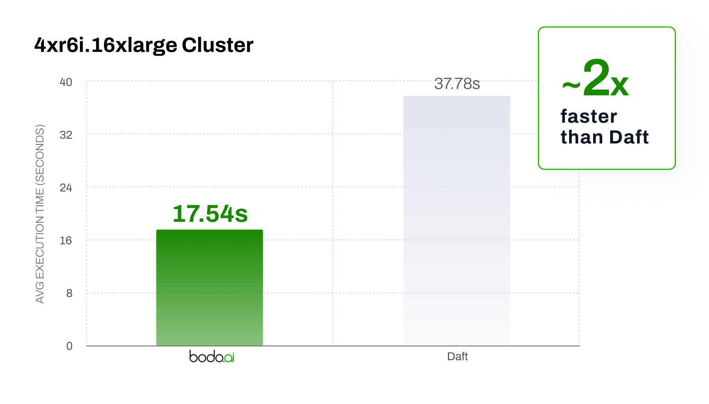
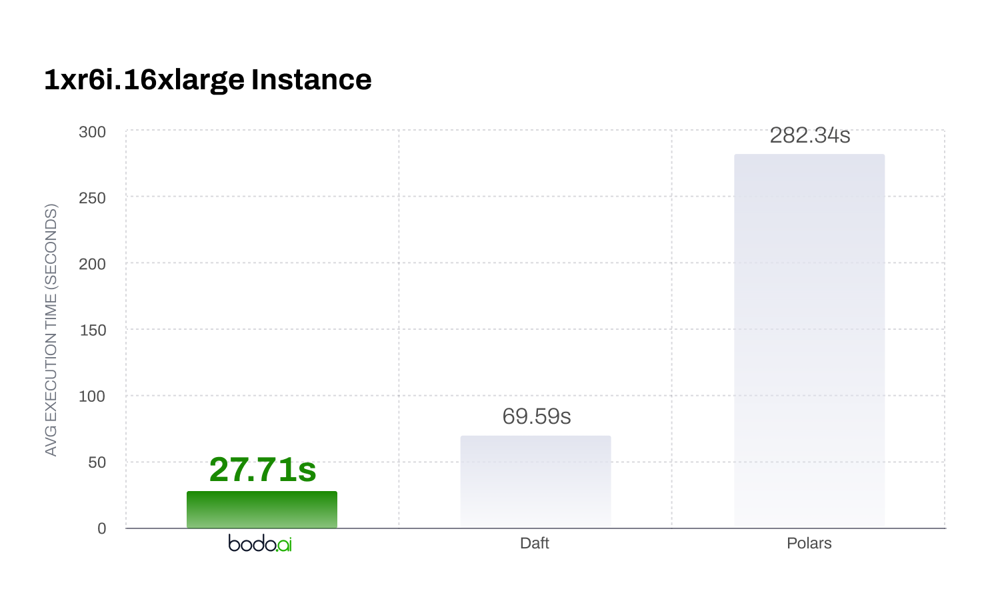
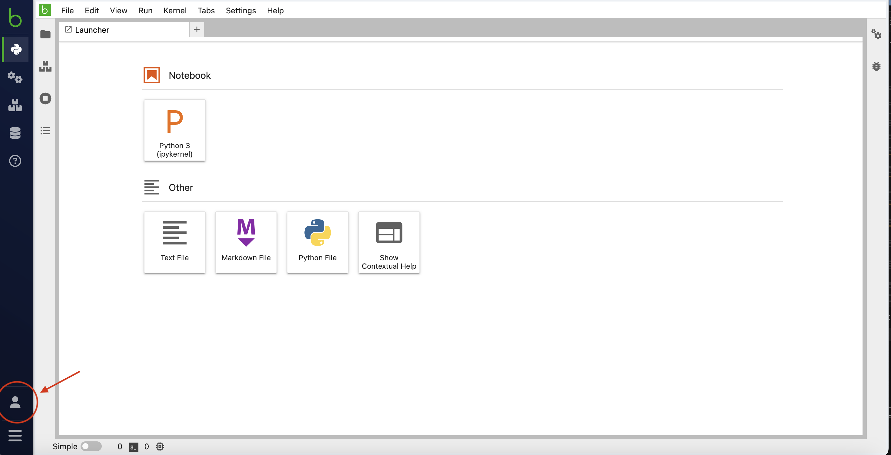

# NYC Taxi Monthly Trips with Precipitation

For this benchmark, we adapt [an example data science workload](https://github.com/toddwschneider/nyc-taxi-data/blob/c65ad8332a44f49770644b11576c0529b40bbc76/citibike_comparison/analysis/analysis_queries.sql#L1) into a pandas workload that reads from a public S3 bucket and calculates the average trip duration and number of trips based on features like weather conditions, pickup and dropoff location, month, and whether the trip was on a weekday.

### Dataset

The New York City Taxi and Limousine Commission's [For Hire Vehicle High Volume dataset](https://www.nyc.gov/site/tlc/about/tlc-trip-record-data.page) (FHVHV) consists of over one billion trips taken by "for hire vehicles" including Uber and Lyft. To get the weather on a given day, we use a separate dataset of [Central Park weather observations](https://github.com/toddwschneider/nyc-taxi-data/blob/c65ad8332a44f49770644b11576c0529b40bbc76/data/central_park_weather.csv). The For Hire Vehicle High Volume dataset consists of 1,036,465,968 rows and 24 columns. The Central Park Weather dataset consists of 5,538 rows and 9 columns.

### Setting

For this benchmark, we use the full FHVHV dataset stored in Parquet files on S3. The total size of this dataset is 24.7 GiB. The Central Park Weather data is stored in a single CSV file on S3 and its total size is 514 KiB.

We compared Bodo's performance on this workload to other systems including [Dask](https://www.dask.org/), [Modin on Ray](https://docs.ray.io/en/latest/ray-more-libs/modin/index.html), and [PySpark](https://spark.apache.org/docs/latest/api/python/index.html) and observed a speedup of 20-240x. The implementations for all of these systems can be found in [`nyc_taxi`](./nyc_taxi/). Versions of the packages used are summarized below.

| Package      | Version      |
|----------------|----------------|
| bodo   | 2024.10   |
| bodosdk | 2.2.0 |
| getdaft   | 0.4.7 |
| dask   | 2024.9.1  |
| dask-cloudprovider  | 2024.9.1  |
| modin   | 0.32.0   |
| polars | 1.25.2 |
| ray   | 2.43.0   |
| spark  | 3.5.2 |

For cluster creation and configuration, we use the [Bodo SDK](https://docs.bodo.ai/2024.12/guides/using_bodo_platform/bodo_platform_sdk_guide/) for Bodo, Dask Cloud Provider for Dask, Ray for Modin and Daft, and AWS EMR for Spark. Scripts to configure and launch clusters for each system can be found in the same directory as the implementation.

Each benchmark is collected on a cluster containing 4 worker instances and 128 physical cores. For the workers, we use `r6i.16xlarge` instances, each consisting of 32 physical cores and 512 GiB of memory. Dask Cloud Provider also allocates an additional `c6i.xlarge` instance for the distributed scheduler which contains 2 cores.

### Results

The graph below summarizes the total execution time of each system (averaged over 3 runs). Results were last collected on December 12th, 2024.



Results for Daft were collected in March 2025.



### Single Node

We compared Bodo, Daft, and Polars performance on a single `r6i.16xlarge` instance and the full dataset. The results are below, these results were collected in March 2025.



## Instructions for Reproducing Benchmark Results

### Pre-requisites

In order to reproduce the results from this benchmark, you will need:

* An AWS account, permissions for using EC2, EMR, and S3 services.
* An account on [Bodo Platform](https://platform.bodo.ai/). Sign up for free trial on AWS Marketplace [here](https://aws.amazon.com/marketplace/pp/prodview-zg6n2qyj5h74o?sr=0-1&ref_=beagle&applicationId=AWSMPContessa). For more details, refer to our [Platform Quick Start documentation](https://docs.bodo.ai/latest/quick_start/quickstart_platform/#aws-marketplace-registration).
* A personal machine with Conda installed/set up.

### Bodo

In order to run the Bodo benchmark:

1. Log in to the [Bodo Platform](https://platform.bodo.ai/).
2. Click on the folder icon in the top left corner, drag and drop `bodo/nyc_taxi_precipitation.py`, which will add the workload script to the `/` directory on your cluster.

    <div style="text-align: center;">
        
    </div>
3. Click on the person icon in the bottom left corner. From there, navigate to __Admin Console__ > __Personal Tokens__ and click __Generate Token__, then copy the Client ID and Secret Key.

    <div style="text-align: center;">
        
    </div>
4. Set the environment variables `BODO_CLIENT_ID` and `BODO_SECRET_KEY` to your Client ID and Secret Key.
5. Install the Bodo SDK using `pip install bodosdk`.
6. Run the script: `python bodo/run_bodo.py --use_jit` which will create a cluster, run the benchmark 3 times and print the results to your local terminal. You can optionally specify number of workers using the `--num_workers` flag, which can be used to reproduce the single node results:
    ``` bash
    python bodo/run_bodo.py --num_workers 1 --use_jit
    ```

> :warning: The Bodo Platform uses a forked version of Arrow to improve parquet read performance. The fork can be found [here](https://github.com/bodo-ai/arrow-cpp-feedstock) and [here](https://github.com/bodo-ai/pyarrow-feedstock).

### Bodo DataFrames

To run the benchmark with Bodo DataFrames, follow steps 1-5 above and run the script without the `--use_jit` flag:
``` bash
python bodo/run_bodo.py
```
or:
``` bash
python bodo/run_bodo.py --num_workers 1
```
To run on a single node.

### Daft

1. Install the [**AWS CLI**](https://docs.aws.amazon.com/cli/latest/userguide/getting-started-install.html) and run `aws configure` to set up your credentials.
2. You will need to make sure you have created the following roles in your AWS IAM console
    * Role with S3FullAccess + EC2FullAccess (required by Ray's autoscaler) in addition a policy that allows passing IAM roles to other nodes (i.e. `iam:PassRole` + `iam:GetRole` on the role created above should be sufficient as described [here](https://docs.aws.amazon.com/IAM/latest/UserGuide/id_roles_use_passrole.html)). Name the role `benchmark-using-ray-head`.
    * Role with S3FullAccess permissions to assign to **worker** nodes. Name the role `benchmark-using-ray-worker`.
3. Install daft and other dependencies for a distributed run: `pip install "getdaft[aws,ray]"`.
4. Run the script:
    ``` bash
    cd daft
    ./run_daft.sh $BUCKET_NAME
    ```
    this script takes in the name of an AWS S3 bucket `BUCKET_NAME`, creates a Ray cluster, and runs the benchmark, writing the resulting DataFrame to `BUCKET_NAME`. You can optionally create a new bucket to store the output using the AWS CLI:
    ``` bash
    BUCKET_NAME=nyc-taxi-benchmark-daft-$(uuidgen | tr -d - | tr '[:upper:]' '[:lower:]' )
    aws s3api create-bucket \
        --bucket $BUCKET_NAME \
        --region us-east-2 \
        --create-bucket-configuration LocationConstraint=us-east-2
    ```
    To run on the single node version, do:
    ``` bash
    ./run_daft_single_node.sh
    ```
    this script writes the result to the head node for simplicity.
5. After inspecting the output, you can clean up any S3 resources created by running:
    ``` bash
    aws s3 rm s3://$BUCKET_NAME --recursive
    aws s3api delete-bucket --bucket $BUCKET_NAME --region us-east-2
    ```

### Dask

In order to run the Dask benchmark:

1. Create a fresh Conda environment with the required packages using the file `dask/env.yml`: `conda env create -f dask/env.yml`.
2. Activate the environment using `conda activate benchmark_dask`.
3. Ensure that you have set your aws credentials e.g. by running `aws configure`. This will be used by Dask Cloud Provider to launch EC2 instances.
4. For reading and writing to S3, you will need to set up an IAM role with sufficient permissions. You can do this using the AWS console by going to __IAM__ > __Roles__ > __Create Role__, then selecting EC2 as the service and `AmazonS3FullAccess` as the permission policy. Name the role "dask-benchmark".

4. Run the benchmark script using `python dask/nyc_taxi_precipitation.py`. This creates the cluster, runs the benchmark 3
times and prints the results to your local terminal. There is also a notebook version of the script available.

### Modin on Ray

In order to run the Modin on Ray benchmark:

1. Enter the benchmark Modin on Ray directory and create a new Conda environment using `env.yml`:
    ``` bash
    cd modin_ray
    conda env create -f env.yml
    ```
2. Activate the environment using `conda activate benchmark_modin`.
3. Ensure that you have set your aws credentials e.g. by running `aws configure`. This will be used by Ray to launch EC2 instances.
4. Run the script `./run_modin.sh`, which will run the benchmark 3 times and print the results to your local terminal. Note that this is a long running script, and if it is interrupted, additional cleanup of resources may be required e.g. running `ray down modin-cluster.yaml -y` in your terminal or terminating the instances in your EC2 console.

### Polars

1. Install the [**AWS CLI**](https://docs.aws.amazon.com/cli/latest/userguide/getting-started-install.html) and run `aws configure` to set up your credentials.
2. The script uses Ray to simplify setup and cleanup of an AWS EC2 instance, to install Ray, you can do `pip install -U "ray[default]"`. To run locally, you will also need to install polars: `pip install "polars[all]"`.
3. Run the script:
    ``` bash
    cd polars
    ./run_polars.sh
    ```
    This will create a single EC2 instance, run the workload 3 times, and finally remove the instance.

### Spark

In order to run the Spark benchmark:

1. Install additional dependencies:

* [**AWS CLI**](https://docs.aws.amazon.com/cli/latest/userguide/getting-started-install.html): Installed and configured with access keys.
* [**Terraform**](https://developer.hashicorp.com/terraform/tutorials/aws-get-started/install-cli): Installed on your local machine.
* [**jq**](https://jqlang.github.io/jq/download/): Installed on your local machine.
* [**gzip**](https://www.gnu.org/software/gzip/): Installed on your local machine.

2. Enter the `spark` directory and initialize terraform:
    ``` bash
    cd spark
    terraform init
    ```
3. Apply the Terraform script to deploy resources and run the benchmark: `terraform apply` and type `yes` when prompted. The python script will be automatically uploaded to an S3 bucket and run on an EMR cluster.
4. Run the following command to wait for the benchmark to complete: `./wait_for_step.sh`.
5. To view the output, download and print the logs using:
    ```bash
    aws s3 cp s3://"$(terraform output --json | jq -r '.s3_bucket_id.value')"/logs/"$(terraform output --json | jq -r '.emr_cluster_id.value')" ./emr-logs --recursive --region "$(terraform output --json | jq -r '.emr_cluster_region.value')"

    # View step logs with execution time result
    gzip -d ./emr-logs/steps/*/*
    cat ./emr-logs/steps/*/stdout
    ```
6. Finally, cleanup resources: `terraform destroy` and type `yes` when prompted.


## Local Benchmark

You can start to see the benefits of using Bodo from your laptop by running the notebooks found in [`./nyc_taxi/notebooks`](./nyc_taxi/notebooks) which include a smaller version of the NYC Taxi Monthly Trips with Precipitation benchmark. To set up, install the required packages using pip in a clean environment that includes Python 3.12:

``` shell
pip install bodo==2025.8.2 "dask[dataframe]"==2024.12.0 "modin[all]"==0.32.0 pyspark==3.5.3 pandas==2.2.3 getdaft==0.4.7 polars==1.25.2 boto3
```

We use a smaller subset of the [For Hire Vehicle High Volume dataset](https://www.nyc.gov/site/tlc/about/tlc-trip-record-data.page) to allow the workload to run locally (example setup: an Apple M2 Macbook Pro with 10 cores and 16 GB memory). We have also included an implementation using Pandas, which is often on par with or better than other distributed frameworks when data size is smaller due to the overhead from coordinating parallel workers. Even at this smaller scale, Bodo JIT shows a roughly 3x improvement over Pandas by just adding a single decorator. Polars shows a similar improvement over Pandas but requires rewriting the entire workload.

The results below were collected December 18th, 2024. Note that these numbers might differ based on your specific hardware and operating system. Daft and Polars results were added in March 2025 and Bodo DataFrames results were collected September 2025.


| System      | Total Execution Time (s)     |
|----------------|----------------|
| Bodo (JIT)  | 1.007   |
| Polars | 1.244   |
| Daft (getdaft) | 2.328 |
| Dask   | 3.091  |
| Pandas | 3.58 |
| Bodo DataFrames | 5.63 |
| Modin/Ray | 13.65 |
| PySpark   | 27.27   |

To see an even bigger difference, try increasing the number of rows read by specifying a different parquet file such as `s3://bodo-example-data/nyc-taxi/fhvhv_tripdata/fhvhv_tripdata_2019-02.parquet`. On this size (~20 million rows), Spark runs out of memory while Pandas and Dask become 4-5x slower than Bodo JIT or Polars.

The code to run the larger dataset is also included in the notebooks section. Results are summarized in the table below.

| System      | Total Execution Time (s)     |
|----------------|----------------|
| Bodo (JIT)  | 4.228   |
| Polars | 4.744   |
| Daft (getdaft) | 7.436 |
| Bodo DataFrames | 10.221 |
| Pandas | 17.990 |
| Dask   | 21.41  |
| Modin/Ray | 118.52 |
| PySpark   | OOM  |
