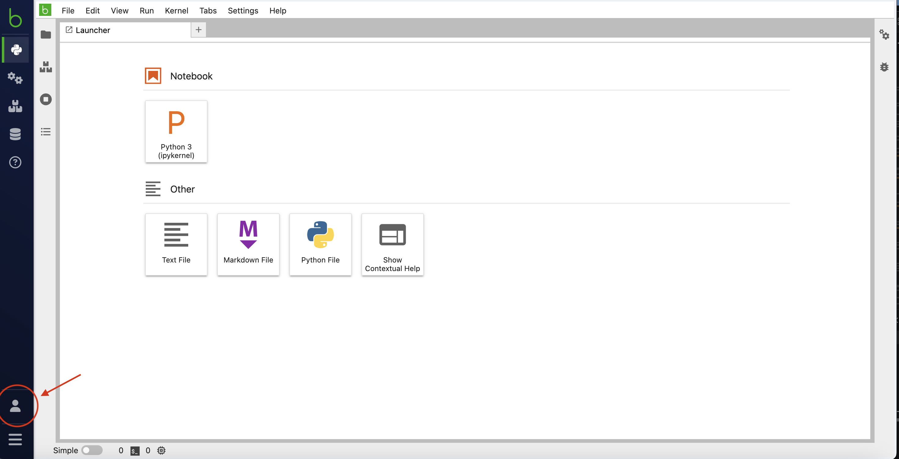

# Reproducing NYC Benchmark

## Pre-requisites

In order to reproduce the results from this benchmark, you will need:

* An AWS account, permissions for using EC2 and EMR services.
* An account on [Bodo Platform](https://platform.bodo.ai/workspaces).
* A personal machine with conda installed/set up.

## Bodo

In order to run the bodo benchmark:

1. Log in to the [Bodo Platform](https://platform.bodo.ai/workspaces)
2. Click on the folder icon in the top left corner, drag and drop `bodo/nyc_taxi_precipitation.py`, which will add the workload script to the `/` directory on your cluster.

    <div style="text-align: center;">
        
    </div>
3. Click on the person icon in the bottom left corner. From there, navigate to __Admin Console__ > __Personal Tokens__ and click __Generate Token__, then copy the Client ID and Secret Key.

    <div style="text-align: center;">
        
    </div>
4. Set the enviornment variables `BODO_CLIENT_ID` and `BODO_SECRET_KEY` to your Client ID and Secret Key.
5. Install the Bodo SDK using `pip install bodosdk`.
6. Run the script: `python bodo/nyc_taxi_precipitation.py` this will create a cluster, run the benchmark 3 times and print the results to your local terminal.

# Dask

1. Create a fresh conda environment with the required packages using the file `dask/env.yml`: `conda env create -f dask/env.yml`.
2. Activate the environment using `conda activate benchmark_dask`.
3. Ensure that you have set your aws credentials e.g. by running `aws configure`. This will be used by Dask Cloud Provider to launch EC2 instances.
4. Run the benchmark script using `python dask/nyc_taxi_precipitation.py`. This creates the cluster, runs the benchmark 3
times and prints the results to your local terminal. There is also a notebook version of the script availible.

# Modin on Ray

1. Create a new conda environment using `modin-ray/env.yml`: `conda env create -f modin-ray/env.yml`.
2. Activate the environment using `conda activate benchmark_modin`
3. Ensure that you have set your aws credentials e.g. by running `aws configure`. This will be used by Ray to launch EC2 instances.
4. Run the script `./run_modin.sh`, which will run the benchmark 3 times and print the results to your local terminal.

# Spark
1. Install additional dependencies:

* [**AWS CLI**](https://docs.aws.amazon.com/cli/latest/userguide/getting-started-install.html): Installed and configured with access keys.
* [**Terraform**](https://developer.hashicorp.com/terraform/tutorials/aws-get-started/install-cli): Installed on your local machine.
* [**jq**](https://jqlang.github.io/jq/download/): Installed on your local machine.
* [**gzip**](https://www.gnu.org/software/gzip/): Installed on your local machine.

2. Enter the benchmark spark directory and initialize terraform:
``` shell
cd spark
terraform init
```
3. Apply the Terraform script to deploy the resources: `terraform apply`.
4. Run the benchmark `./wait_for_steps.sh`, this script will run the benchmark 3 times and output logs to your cluster.
5. To view the output, download and print the logs using:
```bash
aws s3 cp s3://"$(terraform output --json | jq -r '.s3_bucket_id.value')"/logs/"$(terraform output --json | jq -r '.emr_cluster_id.value')" ./emr-logs --recursive --region "$(terraform output --json | jq -r '.emr_cluster_region.value')"

# View step logs with execution time result
gzip -d ./emr-logs/steps/*/*
cat ./emr-logs/steps/*/stdout
```
6. Finally, cleanup resources: `terraform destroy`
