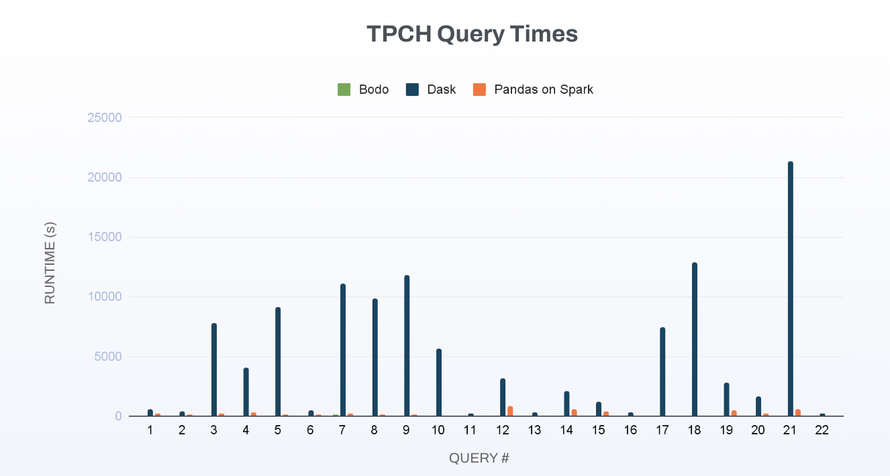
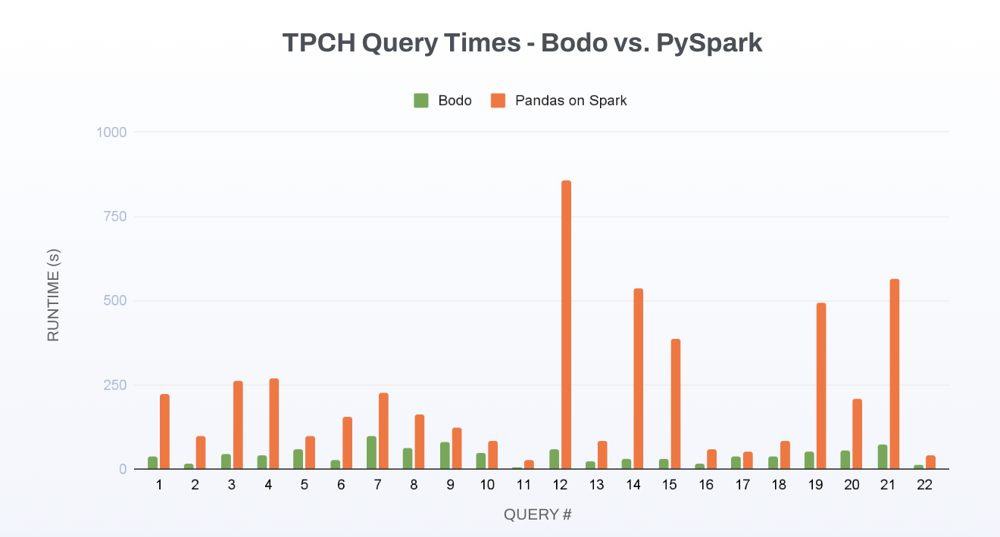

This module contains some of the code used in our blog on performance comparison of Bodo vs. Spark, Dask, and Ray. Read about our findings [here](https://bodo.ai/blog/performance-and-cost-of-bodo-vs-spark-dask-ray).

# About the Queries

We derived these queries from the TPC-H benchmarks. TPC-H is a benchmark suite for business-oriented ad-hoc queries that are used to simulate real questions and is usually used to benchmark the performance of database tools for answering them.

More information can be found [here](http://www.tpc.org/tpch/)


## Generating Data in Parquet Format

### 1. Download and Install tpch-dbgen

```
    git clone https://github.com/Bodo-inc/tpch-dbgen
    cd tpch-dbgen
    make
    cd ../
```

### 2. Generate Data

Usage

```
usage: python generate_data_pq.py [-h] --folder FOLDER [--SF N] [--validate_dataset]

    -h, --help       Show this help message and exit
    folder FOLDER: output folder name (can be local folder or S3 bucket)
    SF N: data size number in GB (Default 1)
    validate_dataset: Validate each parquet dataset with pyarrow.parquet.ParquetDataset (Default True)
```

Example:

Generate 1GB data locally:

`python generate_data_pq.py --SF 1 --folder SF1`

Generate 1TB data and upload to S3 bucket:

`python generate_data_pq.py --SF 1000 --folder s3://bucket-name/`

NOTES:

This script assumes `tpch-dbgen` is in the same directory. If you downloaded it at another location, make sure to update `tpch_dbgen_location` in the script with the new location.

- If using S3 bucket, install `s3fs` and add your AWS credentials.

## 3. Running the Benchmarks

This section describes how to run the benchmark for both the single node and multi-node configurations for the libraries listed below:

### Software versions

| Package      | Version      |
|----------------|----------------|
| bodo   | 2025.12.2   |
| bodosdk | 2.3.2 |
| polars | 1.35.2 |
| pandas | 2.3.3 |
| duckdb | 1.4.2 |
| dask   | 2025.12.0 |
| dask-cloudprovider  | 2025.9.0 |
| PySpark  | 3.5.5 |
<!-- TODO: Daft -->
<!-- TODO: Modin -->

You can install the required libraries with the correct versions using the provided `env.yml` file:

``` shell
conda env create -n tpch_bodo --file env.yml
conda activate tpch_bodo
```

### Single Node

Single-node libraries include Polars, DuckDB, and Pandas. In addition to these options, the distributed engines Dask, PySpark and Bodo can be run on a single node as well. Single node implementations can be found in the `pds-benchmark/queries` directory, which contains Polars, DuckDB queries from the [Polars Decision Support Benchmark repo](https://github.com/pola-rs/polars-benchmark) as well as Dask queries from [here](https://github.com/coiled/benchmarks/blob/main/tests/tpch/dask_queries.py), Bodo and PySpark (Pandas API) queries.

To run a specific query for a specific library, you can use the command below (note all commands should be run from the `pds-benchmark` directory):

``` shell
SCALE_FACTOR=SF PATH_DATA_FOLDER=/path/to/you/tpch/data python -m queries.<IMPL>.q<Q_NUM>
```

To run all queries for a specific library, you can use:
``` shell
SCALE_FACTOR=SF PATH_DATA_FOLDER=/path/to/you/tpch/data python -m queries.<IMPL>
```

When running all queries, each query will be run as a separate Python process and measured based on end-to-end time including IO. Each query will be run at least twice, the first time is considered a "cold start" and will not be logged when reporting the specific query time, although both hot and cold runs will be included in the "total time" reported at the end.

Some implementations like Polars may have multiple modes (streaming, eager, etc). To run Polars with their new streaming mode:

``` shell
RUN_POLARS_STREAMING=1 python -m queries.polars
```

For a complete list of configuration options see `pds-benchmark/settings.py`. These settings can be configured using a `.env` file.

Because Bodo is a drop-in Pandas replacement, we have reused the Bodo queries for the Pandas baseline. You can run the Bodo queries with a Pandas backend using:

``` shell
BODO_USE_PANDAS_BACKEND=1 python -m queries.bodo
```

There is a known issue where Bodo sometimes will hang when running back-to-back queries on Mac, to get around this you can use the `./run_bodo.sh` script, which runs each query's script separately with sleeps in between.

### Multi-Node

Distributed libraries like Bodo, Dask, and PySpark also have the option running on multiple nodes. Because of the different infrastructure requirements for running these libraries, the scripts for reproducing the multi-node results can be found in separate `<impl>/` directories.

#### Bodo

We use the Bodo Platform to create the Bodo cluster. Follow [the instructions here](https://github.com/bodo-ai/Bodo/tree/main/benchmarks/nyc_taxi#bodo) to set up a Bodo Platform account through AWS marketplace and set up access tokens. You can then run the benchmark using the command below (note that bodosdk will have to be installed separately):

``` shell
cd bodo
pip install bodosdk
BODO_CLIENT_ID=... BODO_SECRET_KEY=... python run_bodo.py --folder s3://path/to/data --scale_factor SF --queries 1 2 ...
```

Or omit the `queries` argument to run all queries back-to-back.

#### Dask

We use [Dask Cloudprovider](https://cloudprovider.dask.org/en/latest/) to create the Dask cluster. To ensure that the local environment matches the cluster environment, we provide an additional `env.yml` file in the same directory:

``` shell
cd dask
conda create --file env.yml
conda activate dask_tpch
python dask_queries.py --folder s3://path/to/data --scale_factor SF --queries 1 2 ...
```

#### PySpark (Pandas API on Spark)

We use AWS EMR to create the PySpark cluster. To run, you will need the following additional dependencies installed on your local machine:

* [**AWS CLI**](https://docs.aws.amazon.com/cli/latest/userguide/getting-started-install.html) (Installed and configured with access keys.)
* [**Terraform**](https://developer.hashicorp.com/terraform/tutorials/aws-get-started/install-cli)
* [**jq**](https://jqlang.github.io/jq/download/) (for viewing logs locally)
* [**gzip**](https://www.gnu.org/software/gzip/) (for viewing logs locally)

You can then run the terraform script:

``` shell
cd pyspark
terraform init
terraform apply \
  -var="scale_factor=SF" \
  -var='queries=[1,2,...]' \
  -var="data_folder=s3://path/to/data "
```

This will run the script and write logs to an S3 bucket. You can either view the logs in the AWS console or copy them directly using the following scripts:

``` shell
./wait_for_step.sh

aws s3 cp s3://"$(terraform output --json | jq -r '.s3_bucket_id.value')"/logs/"$(terraform output --json | jq -r '.emr_cluster_id.value')" ./emr-logs --recursive --region "$(terraform output --json | jq -r '.emr_cluster_region.value')"

# View step logs with execution time result
gzip -d ./emr-logs/steps/*/*
cat ./emr-logs/steps/*/stdout
```

Finally, to clean up resources:

``` shell
terraform destroy
```

## 4. Distributed Results (SF1000)

For each distributed system tested: Bodo, PySpark and, Dask, we used a cluster consisting of 4x`r6i.16xlarge` AWS instances (256 vcpus, 2048 GiB Memory). Dask was provisioned an additional instance (`c6i.xlarge`, 4 vcpu/8GiB Memory) for the scheduler and PySpark was provisioned a Primary Instance for cluster management(`c6i.xlarge`) in addition to the 4 core instances.

The table below summarizes the total runtimes for all 22 queries for scale factor (SF) 1000:

| System      | Total Execution Time (s)  |
|----------------|----------------|
| Bodo DataFrames  | 931.8   |
| PySpark | 5086.3   |
| Dask  | 114507.7 |

The following graph shows a breakdown of the individual query times for all systems for SF1000:



The following graph shows a breakdown of the individual query times for Bodo and PySpark for SF1000:



Results were last updated February 4th, 2026. For a full analysis of the results, refer to [our blogpost](https://www.bodo.ai/blog/bodo-dataframes-vs-spark-and-dask-on-tpc-h-benchmarks).