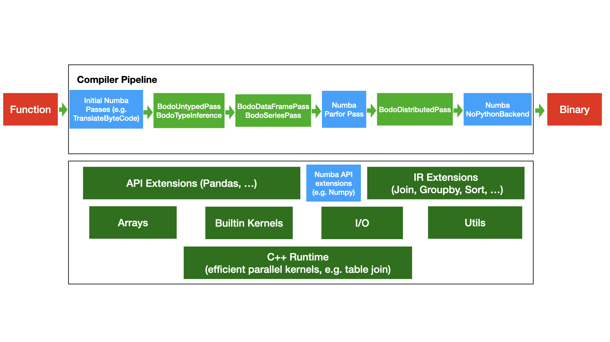

.. _bodo_dev_info:

Bodo Engine Development
=======================

Bodo implements Pandas and Numpy APIs as an embedded DSL.
Data structures are implemented as Numba extensions, and
compiler stages are responsible for transforming different
levels of abstraction, optimization, and parallelization.
For example, `Series data type support <https://github.com/Bodo-inc/Bodo/blob/master/bodo/hiframes/pd_series_ext.py>`_
and `Series transformations <https://github.com/Bodo-inc/Bodo/blob/master/bodo/transforms/series_pass.py>`_
implement the `Pandas Series API <https://pandas.pydata.org/pandas-docs/stable/reference/api/pandas.Series.html>`_.

Bodo Architecture
-----------------

The figure below provides an overview of Bodo's internal architecture.

- The compiler pipeline is described in :ref:`Compiler Stages <dev_compiler_stages>`.
- `API Extensions` are implementations of Python APIs (e.g. Pandas) using
  Numba's extension features such as `overload`.
- `IR Extensions` are Bodo IR nodes such as `Join` which are additions to the basic set of Numba IR nodes (e.g. `ir.Assign`).
- `Arrays` are Bodo's underlying array data structures to hold data for Series/DataFrame, such as strings, decimals, etc.
- `Builtin Kernels` are Bodo's implementation of some operations that cannot be represented in regular parallel loops
  due to more complex parallel structure, such as `unique`.
- `I/O` is Bodo's I/O capabilities, such as scalable read/write of Parquet files.
- `Utils` is a collection of utility functions for all stages of compilation and runtime.
- `C++ Runtime` consists of efficient parallel implementation of some operations in MPI/C++ such as Join.
  Using C++ avoids Numba's compilation time, and enables the use of C++ libraries.

    Bodo Architecture

.. _dev_compiler_stages:

Compiler Stages
---------------

`BodoCompiler <https://github.com/Bodo-inc/Bodo/blob/82e47e6d426cdd7b72c7b7b950a9b8b9b75184fd/bodo/compiler.py#L72>`_
class defines the compiler pipeline (see `here <http://numba.pydata.org/numba-doc/latest/developer/custom_pipeline.html>`_
for Numba's documentation of defining compiler pipelines). Below are the main stages.
Adding `print(pm.passes)` after `this line <https://github.com/Bodo-inc/Bodo/blob/82e47e6d426cdd7b72c7b7b950a9b8b9b75184fd/bodo/compiler.py#L116>`_
prints all the pass classes and their descriptions in the compiler pipeline.
Adding `print([p[0].name() for p in pm.passes])` instead prints the pass names.

- `TranslateByteCode`, ... before `BodoUntypedPass`:
  Numba's frontend passes that process function byte code, generate
  the IR, and prepare for type inference.
- `BodoUntypedPass`: transforms the IR to remove features that Numba's type
  inference cannot support such as non-uniform dictionary input of
  `pd.DataFrame({})`.
- `BodoTypeInference`: Bodo's type inference based on Numba's type inference.
- `BodoSeriesPass`: converts DataFrame/Series operations to Array
  operations as much as possible to provide implementation and enable
  optimization. Creates specialized IR nodes for complex operations like Join.
- `ParforPass`: converts Numpy and prange operations into parfors, fuses all parfors
  if possible, and performs basic optimizations such as copy propagation and
  dead code elimination.
- `BodoDistributedPass`: analyzes the IR to decide parallelism of arrays and
  parfors for distributed transformation, then
  parallelizes the IR for distributed execution and inserts MPI calls.
- `NoPythonBackend`: Numba's backend to generate LLVM IR and eventually binary.

For demonstration of these passes, print the IR after main passes::

    export NUMBA_DEBUG_PRINT_AFTER="ir_processing,bodo_untyped_pass,inline_overloads,bodo_series_pass,parfor_pass,bodo_distributed_pass"

and follow the compiler pipeline (input/output IRs) for a simple function like::

    @bodo.jit
    def f(n):
        S = pd.Series(np.arange(n))
        return S.nunique()

This is the initial IR created by Numba after `ir_processing` stage, which corresponds to the bytecode of the function::

    -----------------------------------------__main__.f: bodo: AFTER ir_processing------------------------------------------
    label 0:
        n = arg(0, name=n)                       ['n']
        $2load_global.0 = global(pd: <module 'pandas' from '/Users/ehsan/opt/anaconda3/envs/DEV/lib/python3.8/site-packages/pandas/__init__.py'>) ['$2load_global.0']
        $4load_method.1 = getattr(value=$2load_global.0, attr=Series) ['$2load_global.0', '$4load_method.1']
        $6load_global.2 = global(np: <module 'numpy' from '/Users/ehsan/opt/anaconda3/envs/DEV/lib/python3.8/site-packages/numpy/__init__.py'>) ['$6load_global.2']
        $8load_method.3 = getattr(value=$6load_global.2, attr=arange) ['$6load_global.2', '$8load_method.3']
        $12call_method.5 = call $8load_method.3(n, func=$8load_method.3, args=[Var(n, uniq.py:8)], kws=(), vararg=None) ['$12call_method.5', '$8load_method.3', 'n']
        $14call_method.6 = call $4load_method.1($12call_method.5, func=$4load_method.1, args=[Var($12call_method.5, uniq.py:8)], kws=(), vararg=None) ['$12call_method.5', '$14call_method.6', '$4load_method.1']
        S = $14call_method.6                     ['$14call_method.6', 'S']
        $20load_method.8 = getattr(value=S, attr=nunique) ['$20load_method.8', 'S']
        $22call_method.9 = call $20load_method.8(func=$20load_method.8, args=[], kws=(), vararg=None) ['$20load_method.8', '$22call_method.9']
        $24return_value.10 = cast(value=$22call_method.9) ['$22call_method.9', '$24return_value.10']
        return $24return_value.10                ['$24return_value.10']

`global` nodes refer to global constants (e.g. `pd` module). `getattr` is getting attribute from an object (e.g. pd.Series).
`call` is a function call and has arguments and a function variable.

The next step is inlining the IR for overloaded methods.
The overload_method implementation for `Series.nunique` is `here <https://github.com/Bodo-inc/Bodo/blob/82e47e6d426cdd7b72c7b7b950a9b8b9b75184fd/bodo/hiframes/series_impl.py#L1193>`_
and has `inline="always"` option. This means that the IR of the implementation will be inlined
in the main function in `inline_overloads` pass. The code that replaces `Series.nunique()` is as follows::

    def impl(S, dropna=True):
        arr = bodo.hiframes.pd_series_ext.get_series_data(S)
        return bodo.libs.array_kernels.nunique(arr)

Here is the IR after this replacement::

    ----------------------------------------__main__.f: bodo: AFTER inline_overloads----------------------------------------
    label 0:
        n = arg(0, name=n)                       ['n']
        $2load_global.0 = global(pd: <module 'pandas' from '/Users/ehsan/opt/anaconda3/envs/DEV/lib/python3.8/site-packages/pandas/__init__.py'>) ['$2load_global.0']
        $4load_method.1 = getattr(value=$2load_global.0, attr=Series) ['$2load_global.0', '$4load_method.1']
        $6load_global.2 = global(np: <module 'numpy' from '/Users/ehsan/opt/anaconda3/envs/DEV/lib/python3.8/site-packages/numpy/__init__.py'>) ['$6load_global.2']
        $8load_method.3 = getattr(value=$6load_global.2, attr=arange) ['$6load_global.2', '$8load_method.3']
        $12call_method.5 = call $8load_method.3(n, func=$8load_method.3, args=[Var(n, uniq.py:8)], kws=(), vararg=None) ['$12call_method.5', '$8load_method.3', 'n']
        $14call_method.6 = call $4load_method.1($12call_method.5, func=$4load_method.1, args=[Var($12call_method.5, uniq.py:8)], kws=(), vararg=None) ['$12call_method.5', '$14call_method.6', '$4load_method.1']
        S = $14call_method.6                     ['$14call_method.6', 'S']
        S.0 = S                                  ['S', 'S.0']
        $2load_global.0.2 = global(bodo: <module 'bodo' from '/Users/ehsan/dev/bodo/bodo/__init__.py'>) ['$2load_global.0.2']
        $4load_attr.1.3 = getattr(value=$2load_global.0.2, attr=hiframes) ['$2load_global.0.2', '$4load_attr.1.3']
        $6load_attr.2.4 = getattr(value=$4load_attr.1.3, attr=pd_series_ext) ['$4load_attr.1.3', '$6load_attr.2.4']
        $8load_method.3.5 = getattr(value=$6load_attr.2.4, attr=get_series_data) ['$6load_attr.2.4', '$8load_method.3.5']
        $12call_method.5.7 = call $8load_method.3.5(S.0, func=$8load_method.3.5, args=[Var(S.0, series_impl.py:1197)], kws=(), vararg=None) ['$12call_method.5.7', '$8load_method.3.5', 'S.0']
        arr.8 = $12call_method.5.7               ['$12call_method.5.7', 'arr.8']
        $16load_global.6.9 = global(bodo: <module 'bodo' from '/Users/ehsan/dev/bodo/bodo/__init__.py'>) ['$16load_global.6.9']
        $18load_attr.7.10 = getattr(value=$16load_global.6.9, attr=libs) ['$16load_global.6.9', '$18load_attr.7.10']
        $20load_attr.8.11 = getattr(value=$18load_attr.7.10, attr=array_kernels) ['$18load_attr.7.10', '$20load_attr.8.11']
        $22load_method.9.12 = getattr(value=$20load_attr.8.11, attr=nunique) ['$20load_attr.8.11', '$22load_method.9.12']
        $26call_method.11.14 = call $22load_method.9.12(arr.8, func=$22load_method.9.12, args=[Var(arr.8, series_impl.py:1197)], kws=(), vararg=None) ['$22load_method.9.12', '$26call_method.11.14', 'arr.8']
        $28return_value.12.15 = $26call_method.11.14 ['$26call_method.11.14', '$28return_value.12.15']
        $22call_method.9 = $28return_value.12.15 ['$22call_method.9', '$28return_value.12.15']
        $24return_value.10 = cast(value=$22call_method.9) ['$22call_method.9', '$24return_value.10']
        return $24return_value.10                ['$24return_value.10']

Series handling pass then optimizes the `pd.Series` object out and passes the data directly to `bodo.libs.array_kernels.nunique()`::

    ----------------------------------------__main__.f: bodo: AFTER bodo_series_pass----------------------------------------
    label 0:
        n = arg(0, name=n)                       ['n']
        $6load_global.2 = global(np: <module 'numpy' from '/Users/ehsan/opt/anaconda3/envs/DEV/lib/python3.8/site-packages/numpy/__init__.py'>) ['$6load_global.2']
        $8load_method.3 = getattr(value=$6load_global.2, attr=arange) ['$6load_global.2', '$8load_method.3']
        $12call_method.5 = call $8load_method.3(n, func=$8load_method.3, args=[Var(n, uniq.py:8)], kws=(), vararg=None) ['$12call_method.5', '$8load_method.3', 'n']
        data.21 = $12call_method.5               ['$12call_method.5', 'data.21']
        data.93 = data.21                        ['data.21', 'data.93']
        data.107 = data.93                       ['data.107', 'data.93']
        $4return_value.1.112 = data.107          ['$4return_value.1.112', 'data.107']
        $18call_method.8.105 = $4return_value.1.112 ['$18call_method.8.105', '$4return_value.1.112']
        $20return_value.9.106 = $18call_method.8.105 ['$18call_method.8.105', '$20return_value.9.106']
        $46call_method.20.49 = $20return_value.9.106 ['$20return_value.9.106', '$46call_method.20.49']
        data_t1.50 = $46call_method.20.49        ['$46call_method.20.49', 'data_t1.50']
        data.114 = data_t1.50                    ['data.114', 'data_t1.50']
        $4return_value.1.118 = data.114          ['$4return_value.1.118', 'data.114']
        $62call_method.27.57 = $4return_value.1.118 ['$4return_value.1.118', '$62call_method.27.57']
        data_t2.58 = $62call_method.27.57        ['$62call_method.27.57', 'data_t2.58']
        $12call_method.5.7 = data_t2.58          ['$12call_method.5.7', 'data_t2.58']
        arr.8 = $12call_method.5.7               ['$12call_method.5.7', 'arr.8']
        $16load_global.6.9 = global(bodo: <module 'bodo' from '/Users/ehsan/dev/bodo/bodo/__init__.py'>) ['$16load_global.6.9']
        $18load_attr.7.10 = getattr(value=$16load_global.6.9, attr=libs) ['$16load_global.6.9', '$18load_attr.7.10']
        $20load_attr.8.11 = getattr(value=$18load_attr.7.10, attr=array_kernels) ['$18load_attr.7.10', '$20load_attr.8.11']
        $22load_method.9.12 = getattr(value=$20load_attr.8.11, attr=nunique) ['$20load_attr.8.11', '$22load_method.9.12']
        $26call_method.11.14 = call $22load_method.9.12(arr.8, func=$22load_method.9.12, args=[Var(arr.8, series_impl.py:1197)], kws=(), vararg=None) ['$22load_method.9.12', '$26call_method.11.14', 'arr.8']
        $28return_value.12.15 = $26call_method.11.14 ['$26call_method.11.14', '$28return_value.12.15']
        $22call_method.9 = $28return_value.12.15 ['$22call_method.9', '$28return_value.12.15']
        $24return_value.10 = cast(value=$22call_method.9) ['$22call_method.9', '$24return_value.10']
        return $24return_value.10                ['$24return_value.10']

Parfor pass then replaces `np.arange()` call with a `parfor <https://github.com/numba/numba/blob/56fc9d7eeb098002753c13480bcde72dcfe0296c/numba/parfors/parfor.py#L517>`_
node, which represents a parallel for loop::

    ------------------------------------------__main__.f: bodo: AFTER parfor_pass-------------------------------------------
    label 0:
        n = arg(0, name=n)                       ['n']
        $start.133.183 = const(int, 0)           ['$start.133.183']
        $step.135.184 = const(int, 1)            ['$step.135.184']
        $dtype.136.185 = const(dtype, int64)     ['$dtype.136.185']
        $14load_global.5.142 = global(bodo: <module 'bodo' from '/Users/ehsan/dev/bodo/bodo/__init__.py'>) ['$14load_global.5.142']
        $16load_attr.6.143 = getattr(value=$14load_global.5.142, attr=libs) ['$14load_global.5.142', '$16load_attr.6.143']
        $18load_attr.7.144 = getattr(value=$16load_attr.6.143, attr=array_kernels) ['$16load_attr.6.143', '$18load_attr.7.144']
        $20load_method.8.145 = getattr(value=$18load_attr.7.144, attr=calc_nitems) ['$18load_attr.7.144', '$20load_method.8.145']
        $nitems.150.186 = call $20load_method.8.145($start.133.183, n, $step.135.184, func=$20load_method.8.145, args=[Var($start.133.183, array_kernels.py:1181), Var(n, uniq.py:8), Var($step.135.184, array_kernels.py:1181)], kws=(), vararg=None) ['$20load_method.8.145', '$nitems.150.186', '$start.133.183', '$step.135.184', 'n']
        $32load_global.13.151 = global(np: <module 'numpy' from '/Users/ehsan/opt/anaconda3/envs/DEV/lib/python3.8/site-packages/numpy/__init__.py'>) ['$32load_global.13.151']
        $34load_method.14.152 = getattr(value=$32load_global.13.151, attr=empty) ['$32load_global.13.151', '$34load_method.14.152']
        $arr.156.187 = call $34load_method.14.152($nitems.150.186, $dtype.136.185, func=$34load_method.14.152, args=[Var($nitems.150.186, array_kernels.py:1206), Var($dtype.136.185, array_kernels.py:1181)], kws=(), vararg=None) ['$34load_method.14.152', '$arr.156.187', '$dtype.136.185', '$nitems.150.186']
        $16load_global.6.9 = global(bodo: <module 'bodo' from '/Users/ehsan/dev/bodo/bodo/__init__.py'>) ['$16load_global.6.9']
        $18load_attr.7.10 = getattr(value=$16load_global.6.9, attr=libs) ['$16load_global.6.9', '$18load_attr.7.10']
        $20load_attr.8.11 = getattr(value=$18load_attr.7.10, attr=array_kernels) ['$18load_attr.7.10', '$20load_attr.8.11']
        $22load_method.9.12 = getattr(value=$20load_attr.8.11, attr=nunique) ['$20load_attr.8.11', '$22load_method.9.12']
    ---begin parfor 0---
    index_var =  parfor_index.180
    params =  {'$arr.156.187', '$step.135.184', '$start.133.183'}
    races =  set()
    LoopNest(index_variable = parfor_index.180, range = (0, $nitems.150.186, 1))
    init block:
    label 79:
        i.169 = parfor_index.180                 ['i.169', 'parfor_index.180']
        $68binary_multiply.5.173 = i.169 * $step.135.184 ['$68binary_multiply.5.173', '$step.135.184', 'i.169']
        $70binary_add.6.174 = $start.133.183 + $68binary_multiply.5.173 ['$68binary_multiply.5.173', '$70binary_add.6.174', '$start.133.183']
        $arr.156.187[parfor_index.180] = $70binary_add.6.174 ['$70binary_add.6.174', '$arr.156.187', 'parfor_index.180']
    ----end parfor 0----
        $26call_method.11.14 = call $22load_method.9.12($arr.156.187, func=$22load_method.9.12, args=[Var($arr.156.187, array_kernels.py:1207)], kws=(), vararg=None) ['$22load_method.9.12', '$26call_method.11.14', '$arr.156.187']
        $24return_value.10 = cast(value=$26call_method.11.14) ['$24return_value.10', '$26call_method.11.14']
        return $24return_value.10                ['$24return_value.10']

At this point, all the elements in the program are parallelizable in distributed pass:
allocation with np.empty, parfor, and bodo.libs.array_kernels.nunique
which is a builtin function.
Distributed pass first analyzes parallelism in the program
(`here <https://github.com/Bodo-inc/Bodo/blob/82e47e6d426cdd7b72c7b7b950a9b8b9b75184fd/bodo/transforms/distributed_analysis.py#L178>`_),
then divides the allocation call and loop start/stop
across processors based on `rank` and total number of processors.
Hence, each process will allocate its own chunk of data, and work on
its own iteration range in parallel loops.
In addition, it replaces the
builtin function `nunique` with its parallel version `nunique_parallel`, and converts the parfor into a regular loop::

    -------------------------------------__main__.f: bodo: AFTER bodo_distributed_pass--------------------------------------
    label 0:
        $2load_global.0.211 = global(_get_rank: CPUDispatcher(<function get_rank at 0x7fe8d9638b80>)) ['$2load_global.0.211']
        rank_var.214 = call $2load_global.0.211(func=$2load_global.0.211, args=[], kws=(), vararg=None) ['$2load_global.0.211', 'rank_var.214']
        $2load_global.0.215 = global(_get_size: CPUDispatcher(<function get_size at 0x7fe8da326550>)) ['$2load_global.0.215']
        n_pes_var.218 = call $2load_global.0.215(func=$2load_global.0.215, args=[], kws=(), vararg=None) ['$2load_global.0.215', 'n_pes_var.218']
        n = arg(0, name=n)                       ['n']
        $start.133.183 = const(int, 0)           ['$start.133.183']
        $step.135.184 = const(int, 1)            ['$step.135.184']
        $dtype.136.185 = const(dtype, int64)     ['$dtype.136.185']
        $14load_global.5.142 = global(bodo: <module 'bodo' from '/Users/ehsan/dev/bodo/bodo/__init__.py'>) ['$14load_global.5.142']
        $16load_attr.6.143 = getattr(value=$14load_global.5.142, attr=libs) ['$14load_global.5.142', '$16load_attr.6.143']
        $18load_attr.7.144 = getattr(value=$16load_attr.6.143, attr=array_kernels) ['$16load_attr.6.143', '$18load_attr.7.144']
        $20load_method.8.145 = getattr(value=$18load_attr.7.144, attr=calc_nitems) ['$18load_attr.7.144', '$20load_method.8.145']
        $n.236.292 = call $20load_method.8.145($start.133.183, n, $step.135.184, func=$20load_method.8.145, args=[Var($start.133.183, array_kernels.py:1181), Var(n, uniq.py:8), Var($step.135.184, array_kernels.py:1181)], kws=(), vararg=None) ['$20load_method.8.145', '$n.236.292', '$start.133.183', '$step.135.184', 'n']
        $32load_global.13.151 = global(np: <module 'numpy' from '/Users/ehsan/opt/anaconda3/envs/DEV/lib/python3.8/site-packages/numpy/__init__.py'>) ['$32load_global.13.151']
        $34load_method.14.152 = getattr(value=$32load_global.13.151, attr=empty) ['$32load_global.13.151', '$34load_method.14.152']
        $res.223.294 = $n.236.292 % n_pes_var.218 ['$n.236.292', '$res.223.294', 'n_pes_var.218']
        $14binary_floor_divide.5.224 = $n.236.292 // n_pes_var.218 ['$14binary_floor_divide.5.224', '$n.236.292', 'n_pes_var.218']
        $16load_global.6.225 = global(min: <built-in function min>) ['$16load_global.6.225']
        $const20.8.226 = const(int, 1)           ['$const20.8.226']
        $22binary_add.9.227 = rank_var.214 + $const20.8.226 ['$22binary_add.9.227', '$const20.8.226', 'rank_var.214']
        $26call_function.11.228 = call $16load_global.6.225($22binary_add.9.227, $res.223.294, func=$16load_global.6.225, args=[Var($22binary_add.9.227, array_kernels.py:1207), Var($res.223.294, array_kernels.py:1207)], kws=(), vararg=None) ['$16load_global.6.225', '$22binary_add.9.227', '$26call_function.11.228', '$res.223.294']
        $28binary_add.12.229 = $14binary_floor_divide.5.224 + $26call_function.11.228 ['$14binary_floor_divide.5.224', '$26call_function.11.228', '$28binary_add.12.229']
        $30load_global.13.230 = global(min: <built-in function min>) ['$30load_global.13.230']
        $36call_function.16.231 = call $30load_global.13.230(rank_var.214, $res.223.294, func=$30load_global.13.230, args=[Var(rank_var.214, uniq.py:6), Var($res.223.294, array_kernels.py:1207)], kws=(), vararg=None) ['$30load_global.13.230', '$36call_function.16.231', '$res.223.294', 'rank_var.214']
        $count_var.235.293 = $28binary_add.12.229 - $36call_function.16.231 ['$28binary_add.12.229', '$36call_function.16.231', '$count_var.235.293']
        $arr.266.295 = call $34load_method.14.152($count_var.235.293, $dtype.136.185, func=$34load_method.14.152, args=[Var($count_var.235.293, array_kernels.py:1207), Var($dtype.136.185, array_kernels.py:1181)], kws=(), vararg=None) ['$34load_method.14.152', '$arr.266.295', '$count_var.235.293', '$dtype.136.185']
        $8binary_floor_divide.3.239 = $n.236.292 // n_pes_var.218 ['$8binary_floor_divide.3.239', '$n.236.292', 'n_pes_var.218']
        $10binary_multiply.4.240 = rank_var.214 * $8binary_floor_divide.3.239 ['$10binary_multiply.4.240', '$8binary_floor_divide.3.239', 'rank_var.214']
        $12load_global.5.241 = global(min: <built-in function min>) ['$12load_global.5.241']
        $20binary_modulo.9.242 = $n.236.292 % n_pes_var.218 ['$20binary_modulo.9.242', '$n.236.292', 'n_pes_var.218']
        $22call_function.10.243 = call $12load_global.5.241(rank_var.214, $20binary_modulo.9.242, func=$12load_global.5.241, args=[Var(rank_var.214, uniq.py:6), Var($20binary_modulo.9.242, array_kernels.py:1208)], kws=(), vararg=None) ['$12load_global.5.241', '$20binary_modulo.9.242', '$22call_function.10.243', 'rank_var.214']
        start_var.246 = $10binary_multiply.4.240 + $22call_function.10.243 ['$10binary_multiply.4.240', '$22call_function.10.243', 'start_var.246']
        $const4.1.250 = const(int, 1)            ['$const4.1.250']
        $6binary_add.2.251 = rank_var.214 + $const4.1.250 ['$6binary_add.2.251', '$const4.1.250', 'rank_var.214']
        $12binary_floor_divide.5.252 = $n.236.292 // n_pes_var.218 ['$12binary_floor_divide.5.252', '$n.236.292', 'n_pes_var.218']
        $14binary_multiply.6.253 = $6binary_add.2.251 * $12binary_floor_divide.5.252 ['$12binary_floor_divide.5.252', '$14binary_multiply.6.253', '$6binary_add.2.251']
        $16load_global.7.254 = global(min: <built-in function min>) ['$16load_global.7.254']
        $const20.9.255 = const(int, 1)           ['$const20.9.255']
        $22binary_add.10.256 = rank_var.214 + $const20.9.255 ['$22binary_add.10.256', '$const20.9.255', 'rank_var.214']
        $28binary_modulo.13.257 = $n.236.292 % n_pes_var.218 ['$28binary_modulo.13.257', '$n.236.292', 'n_pes_var.218']
        $30call_function.14.258 = call $16load_global.7.254($22binary_add.10.256, $28binary_modulo.13.257, func=$16load_global.7.254, args=[Var($22binary_add.10.256, array_kernels.py:1208), Var($28binary_modulo.13.257, array_kernels.py:1208)], kws=(), vararg=None) ['$16load_global.7.254', '$22binary_add.10.256', '$28binary_modulo.13.257', '$30call_function.14.258']
        end_var.261 = $14binary_multiply.6.253 + $30call_function.14.258 ['$14binary_multiply.6.253', '$30call_function.14.258', 'end_var.261']
        $range_g_var.284 = global(range: <class 'range'>) ['$range_g_var.284']
        $range_c_var.285 = call $range_g_var.284(start_var.246, end_var.261, func=$range_g_var.284, args=[Var(start_var.246, array_kernels.py:1208), Var(end_var.261, array_kernels.py:1208)], kws=(), vararg=None) ['$range_c_var.285', '$range_g_var.284', 'end_var.261', 'start_var.246']
        $iter_var.286 = getiter(value=$range_c_var.285) ['$iter_var.286', '$range_c_var.285']
        jump 111                                 []
    label 111:
        $iternext_var.288 = iternext(value=$iter_var.286) ['$iter_var.286', '$iternext_var.288']
        $pair_first_var.289 = pair_first(value=$iternext_var.288) ['$iternext_var.288', '$pair_first_var.289']
        $pair_second_var.290 = pair_second(value=$iternext_var.288) ['$iternext_var.288', '$pair_second_var.290']
        parfor_index.180 = $pair_first_var.289   ['$pair_first_var.289', 'parfor_index.180']
        branch $pair_second_var.290, 112, 113    ['$pair_second_var.290']
    label 112:
        i.169 = parfor_index.180                 ['i.169', 'parfor_index.180']
        $68binary_multiply.5.173 = i.169 * $step.135.184 ['$68binary_multiply.5.173', '$step.135.184', 'i.169']
        $70binary_add.6.174 = $start.133.183 + $68binary_multiply.5.173 ['$68binary_multiply.5.173', '$70binary_add.6.174', '$start.133.183']
        ind.262 = parfor_index.180               ['ind.262', 'parfor_index.180']
        $6binary_subtract.2.264 = ind.262 - start_var.246 ['$6binary_subtract.2.264', 'ind.262', 'start_var.246']
        $arr.266.295[$6binary_subtract.2.264] = $70binary_add.6.174 ['$6binary_subtract.2.264', '$70binary_add.6.174', '$arr.266.295']
        jump 111                                 []
    label 113:
        $2load_global.0.267 = global(bodo: <module 'bodo' from '/Users/ehsan/dev/bodo/bodo/__init__.py'>) ['$2load_global.0.267']
        $4load_attr.1.268 = getattr(value=$2load_global.0.267, attr=libs) ['$2load_global.0.267', '$4load_attr.1.268']
        $6load_attr.2.269 = getattr(value=$4load_attr.1.268, attr=array_kernels) ['$4load_attr.1.268', '$6load_attr.2.269']
        $8load_method.3.270 = getattr(value=$6load_attr.2.269, attr=nunique_parallel) ['$6load_attr.2.269', '$8load_method.3.270']
        $12call_method.5.271 = call $8load_method.3.270($arr.266.295, func=$8load_method.3.270, args=[Var($arr.266.295, array_kernels.py:1207)], kws=(), vararg=None) ['$12call_method.5.271', '$8load_method.3.270', '$arr.266.295']
        $24return_value.10 = cast(value=$12call_method.5.271) ['$12call_method.5.271', '$24return_value.10']
        $2load_global.0.273 = global(_barrier: CPUDispatcher(<function barrier at 0x7fe8da326700>)) ['$2load_global.0.273']
        $4call_function.1.274 = call $2load_global.0.273(func=$2load_global.0.273, args=[], kws=(), vararg=None) ['$2load_global.0.273', '$4call_function.1.274']
        return $24return_value.10                ['$24return_value.10']

Finally, Numba converts this IR to LLVM IR and generates the binary.

.. _dev_builtin_functions:

Builtin Functions
-----------------

As we just observed for ``nunique`` in the previous example,
Bodo transforms Pandas APIs (and others if needed) into *builtin*
functions that can be analyzed and optimized throughout the pipeline.
Different stages of the compiler handle these functions if necessary,
with all the analysis for them available if needed.

For example, ``get_series_data`` function is used for getting the underlying
data array of a Series object. BodoSeriesPass removes this function
if the data array is available at that point in the program
(Series object was created using ``init_series`` and not altered).

For the pipeline to handle a builtin function properly
the following has to be specified:

- side effects for dead code elimination
- aliasing
- inlining (if necessary)
- array analysis
- distributed analysis (including array access analysis)
- distributed transformation

For example, ``get_series_data`` does not have side effects and can be removed
if output is not live. In addition, the output is aliased with the input,
and both have the same parallel distribution.

.. _dev_ir_extensions:

IR Extensions
-------------

Bodo uses IR extensions for operations that are too complex for
builtin functions to represent. For example, Join and Aggregate nodes
represent `merge` and `groupby/aggregate` operations of Pandas respectively.
IR extensions have full transformation and analysis support (usually
more extensive that builtin functions).

.. _dev_code_structure:

Code Structure
--------------

Below is the high level structure of the code.

- ``transforms`` directory defines Bodo specific analysis and transformation
  passes such distributed analysis and transformation.
- ``hiframes`` directory provides Pandas functionality such as DataFrame,
  Series and Index.
- ``ir`` directory defines and implements Bodo specific IR nodes such as
  Sort and Join.
- ``libs`` directory provides supporting data structures and libraries such as
  Bodo arrays, distributed APIs. It also includes helper C/C++
  extensions and C++ runtime engine for join, groupby and other operations.
- ``io`` directory provides I/O support such as CSV, HDF5, Parquet and Numpy.
- ``tests`` provides unittests.
- ``utils`` provides utility functions for various stages of compilation
  such as typing and codegen.
- ``decorators.py`` is the starting point, which defines decorators of Bodo.
  Currently just ``@jit`` is provided but more is expected.
- ``compiler.py`` defines the compiler pipeline for this decorator.
- ``numba_compat.py`` includes our Numba monkey patches (i.e. replaces some internals of Numba for Bodo purposes).
- ``master_mode.py`` defines an experimental master/executor mode.

.. _pandas_extensions:

Supporting New Data Structures and APIs
---------------------------------------

Comprehensive coverage of analytics data structures and APIs is an important goal for Bodo.
To support new data structures and APIs, we need to create Numba extensions for them.
Our `datetime.datetime <https://github.com/Bodo-inc/Bodo/blob/ddf9434081f1f092a3a0757bd3c5faa44ba3a61c/bodo/hiframes/datetime_datetime_ext.py>`_
support is a straighforward example. Also see `Numba documentation for extensions <http://numba.pydata.org/numba-doc/latest/extending/index.html>`_.

There are more requirements when supporting APIs that need to be parallelized (such as Pandas APIs).
The implementation should be parallelization, which means it has to use only
parallelizable constructs (other parallel APIs, prange, builtins).
In addition, the implementation has to be inlined so that
the distributed pass can analyze and parallelize it (see the nunique example above).

Pandas APIs in particular have a lot of nuances to handle. But internal code of Pandas
is reasonably readable. Therefore, it is recommended to step through the
implementation using simple inputs to understand the functionality in detail.
For example, one can use `pdb.run('S.sum()')` inside ``ipython`` to step through `sum` method
of Series objects.

When a function is not performance critical, we can support it using the `object` mode of Numba
(see `objmode docs <http://numba.pydata.org/numba-doc/latest/user/withobjmode.html>`_)
to avoid extensive effort of providing native implementation.
This means that the jit execution jumps into regular python to run the implementation.
See our `re.search implementation <https://github.com/Bodo-inc/Bodo/blob/ddf9434081f1f092a3a0757bd3c5faa44ba3a61c/bodo/libs/re_ext.py#L151>`_
as an example.

.. _array_extensions:

Create an Array
---------------------------------------

To provide sufficient coverage of analytical data structures and APIs you may find it necessary to create an
array for a type not previously available. Unfortunately bodo cannot support arrays with `dtype=object`,
so any object type that needs to be contained in an array must have a custom class and array stucture defined, which
is used instead of a call to numpy or another array creation technique. For a detailed example look at the example with the `datetime.date` array `shown here 
<https://github.com/Bodo-inc/Bodo/blob/ddf9434081f1f092a3a0757bd3c5faa44ba3a61c/bodo/hiframes/datetime_date_ext.py#L549>`_.
In addition, consider looking at the example on adding a new type in the
`numba documentation <https://numba.pydata.org/numba-doc/latest/extending/interval-example.html>`_.

In general you should be able to copy much of the implementation in the example, but there are a couple things you should note:

- If you want support for indexing already provided in `bodo/utils/indexing.py`, you need your data represented with two attributes: `_data` and `_null_bitmap`.
- The `unbox` and `box` conversions require directly using `llvmlite`. It may also be difficult to express everything in 
  Python, so you may need to contribute C++ code (see this 
  `example <https://github.com/Bodo-inc/Bodo/blob/ddf9434081f1f092a3a0757bd3c5faa44ba3a61c/bodo/libs/_datetime_ext.cpp#L162>`_). 
  If so you remember you are responsible for decrementing reference counts when engaging with `PyObjs`.
- If you find yourself writing C++ code, you will need to register your bindings with LLVM
  (see `the Python version 
  <https://github.com/Bodo-inc/Bodo/blob/ddf9434081f1f092a3a0757bd3c5faa44ba3a61c/bodo/hiframes/datetime_date_ext.py#L58>`_ 
  and `the C++ portion <https://github.com/Bodo-inc/Bodo/blob/ddf9434081f1f092a3a0757bd3c5faa44ba3a61c/bodo/libs/_datetime_ext.cpp#L319>`_).
- Arrays have a lot of operations they need to support. Hopefully exactly what operations are required is comming soon. However, until then it is likely
  necessary to just try copy the code from `datetime_date_array`. Consider searching for exactly what operation are supported with a command like
  `grep -r datetime_date_array .` from the `bodo` root directory. Be careful though because it is easy to miss operations.
- You must add your array to `is_array_typ` in `bodo/utils/utils.py`. Failure to add your array here fails to define the array but may not thrown an error
  (so you won't know you are missing operations).
- If you find an operation isn't supported you likely just forgot to provide support for that operation. Look for that operation explicitly for 
  `datetime_date_array` and then search for that operation. You likely need to add your new array types to the types supporting that operation, but be careful
  to rewrite the operation for the fields/functions you explicitly support.

Overall your array will likely be very similar, with some adjustments made to support your native representation and the operations
you need to support.

.. _parallelization_debug:

Debugging Parallelization Issues
--------------------------------

Parallelization bugs are likely when a function works sequentially but segfaults or produces
wrong results when run in parallel. To debug these cases, set these environment
variables to see the IR before distributed analysis, as well as the distributions assigned to
variables::

    export NUMBA_DEBUG_PRINT_AFTER="parfor_pass"
    export BODO_DISTRIBUTED_DIAGNOSTICS=1

If distribution of a variable is wrong, the most likely cause is a function not being handled
properly in distributed analysis (input/output distributions not set properly).

If distribution analysis is correct, distributed transformation issues could be the cause
which can be checked by looking at the IR after transformation::

    export NUMBA_DEBUG_PRINT_AFTER="bodo_distributed_pass"

In addition, many operations are implemented in Bodo's MPI/C++ runtime, which would require debugging
similar to other MPI/C++ codes. See :ref:`dev_debugging`.

.. _resources:

Resources
---------

Papers
~~~~~~

These papers provide deeper dive in technical ideas
(may not be necessary for many developers):

- `Bodo paper on automatic parallelization for distributed memory <http://dl.acm.org/citation.cfm?id=3079099>`_
- `Bodo paper on system architecture versus Spark <http://dl.acm.org/citation.cfm?id=3103004>`_
- `Bodo Dataframe DSL approach <https://arxiv.org/abs/1704.02341>`_
- `ParallelAccelerator DSL approach <https://users.soe.ucsc.edu/~lkuper/papers/parallelaccelerator-ecoop17.pdf>`_
