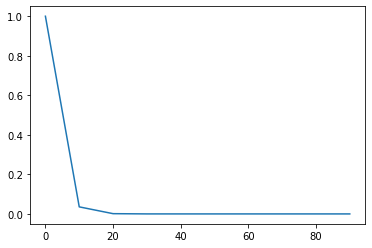

# Data Visualization {#data_visualization}

[!NOTE]
> This is an experimental feature and may not function as intended in all scenarios. Please share any feedback or issues encountered for further improvement.


Bodo supports Matplotlib visualization natively inside JIT functions.
This page specifies the supported Matplotlib APIs and classes. In
general, these APIs support all arguments except for the restrictions
specified in each section.

## Plotting APIs

Currently, Bodo automatically supports the following plotting APIs.

-   `matplotlib.pyplot.plot`
-   `matplotlib.pyplot.scatter`
-   `matplotlib.pyplot.bar`
-   `matplotlib.pyplot.contour`
-   `matplotlib.pyplot.contourf`
-   `matplotlib.pyplot.quiver`
-   `matplotlib.pyplot.pie` 
    (`autopct` must be a constant boolean or omitted)
-   `matplotlib.pyplot.fill`
-   `matplotlib.pyplot.fill_between`
-   `matplotlib.pyplot.step`
-   `matplotlib.pyplot.errorbar`
-   `matplotlib.pyplot.barbs`
-   `matplotlib.pyplot.eventplot`
-   `matplotlib.pyplot.hexbin`
-   `matplotlib.pyplot.xcorr`
    (`autopct` must be a constant boolean or omitted)
-   `matplotlib.pyplot.imshow`
-   `matplotlib.pyplot.plot`
-   `matplotlib.pyplot.scatter`
-   `matplotlib.pyplot.bar`
-   `matplotlib.axes.Axes.contour`
-   `matplotlib.axes.Axes.contourf`
-   `matplotlib.axes.Axes.quiver`
-   `matplotlib.axes.Axes.pie`
    (`usevlines` must be a constant boolean or omitted)
-   `matplotlib.axes.Axes.fill`
-   `matplotlib.axes.Axes.fill_between`
-   `matplotlib.axes.Axes.step`
-   `matplotlib.axes.Axes.errorbar`
-   `matplotlib.axes.Axes.barbs`
-   `matplotlib.axes.Axes.eventplot`
-   `matplotlib.axes.Axes.hexbin`
-   `matplotlib.axes.Axes.xcorr`
    (`usevlines` must be a constant boolean or omitted)
-   `matplotlib.axes.Axes.imshow`

These APIs have the following restrictions:

-   The data being plotted must be Numpy arrays and not Pandas data
    structures.
-   Use of lists is not currently supported. If you need to plot
    multiple arrays use a tuple or a 2D Numpy array.

These functions work by automatically gathering all of the data onto one
machine and then plotting the data. If there is not enough memory on
your machine, a sample of the data can be selected. The example code
below demonstrates calling plot with a sample of the data:

``` py
import matplotlib.pyplot as plt

%matplotlib inline

@bodo.jit
def dist_plot(n):
    X = np.arange(n)
    Y = np.exp(-X/3.0)
    plt.plot(X[::10], Y[::10]) # gather every 10th element
    plt.show()

dist_plot(100)
```

```console
[output:0]
```



## Formatting APIs

In addition to plotting, we also support a variety of formatting APIs to
modify your figures.

-   `matplotlib.pyplot.gca`
-   `matplotlib.pyplot.gcf`
-   `matplotlib.pyplot.text`
-   `matplotlib.pyplot.subplots`
    (`nrows` and `ncols` must be constant integers)
-   `matplotlib.pyplot.suptitle`
-   `matplotlib.pyplot.tight_layout`
-   `matplotlib.pyplot.savefig`
-   `matplotlib.pyplot.draw`
-   `matplotlib.pyplot.show` 
    (Output is only displayed on rank 0)
-   `matplotlib.figure.Figure.suptitle`
-   `matplotlib.figure.Figure.tight_layout`
-   `matplotlib.figure.Figure.subplots`
    (`nrows` and `ncols` must be constant integers)
-   `matplotlib.figure.Figure.show`
    (Output is only displayed on rank 0)
-   `matplotlib.axes.Axes.annotate`
-   `matplotlib.axes.Axes.text`
-   `matplotlib.axes.Axes.set_xlabel`
-   `matplotlib.axes.Axes.set_ylabel`
-   `matplotlib.axes.Axes.set_xscale`
-   `matplotlib.axes.Axes.set_yscale`
-   `matplotlib.axes.Axes.set_xticklabels`
-   `matplotlib.axes.Axes.set_yticklabels`
-   `matplotlib.axes.Axes.set_xlim`
-   `matplotlib.axes.Axes.set_ylim`
-   `matplotlib.axes.Axes.set_xticks`
-   `matplotlib.axes.Axes.set_yticks`
-   `matplotlib.axes.Axes.set_axis_on`
-   `matplotlib.axes.Axes.set_axis_off`
-   `matplotlib.axes.Axes.draw`
-   `matplotlib.axes.Axes.set_title`
-   `matplotlib.axes.Axes.legend`
-   `matplotlib.axes.Axes.grid`

In general these APIs support all arguments except for the restrictions
specified. In addition, APIs have the following restrictions:

-   Use of lists is not currently supported. If you need to provide a
    list, please use a tuple instead.
-   Formatting functions execute on all ranks by default. If you need
    to execute further Matplotlib code on all of your processes,
    please close any figures you opened inside Bodo.

## Matplotlib Classes {#matplotlib_classes}

Bodo supports the following Matplotlib classes when used with the
previously mentioned APIs:

-   `matplotlib.figure.Figure`
-   `matplotlib.axes.Axes`
-   `matplotlib.text.Text`
-   `matplotlib.text.Annotation`
-   `matplotlib.lines.Line2D`
-   `matplotlib.collections.PathCollection`
-   `matplotlib.container.BarContainer`
-   `matplotlib.contour.QuadContourSet`
-   `matplotlib.quiver.Quiver`
-   `matplotlib.patches.Wedge`
-   `matplotlib.patches.Polygon`
-   `matplotlib.collections.PolyCollection`
-   `matplotlib.image.AxesImage`
-   `matplotlib.container.ErrorbarContainer`
-   `matplotlib.quiver.Barbs`
-   `matplotlib.collections.EventCollection`
-   `matplotlib.collections.LineCollection`

## Working with Unsupported APIs

For other visualization functions, you can call them from regular Python
and manually gather the data. If the data does not fit in a single
machine's memory, you may need to take a sample. The example code below
demonstrates gathering a portion of data in Bodo and calling polar
(which Bodo doesn't support yet) in regular Python:

```py
import bodo
import numpy as np
import matplotlib.pyplot as plt

@bodo.jit
def dist_gather_test(n):
    X = np.arange(n)
    Y = 3 - np.cos(X)
    return bodo.gatherv(X[::10]), bodo.gatherv(Y[::10])  # gather every 10th element

X_Sample, Y_Sample = dist_gather_test(1000)
if bodo.get_rank() == 0:
    plt.polar(X_Sample, Y_Sample)
    plt.show()
```


