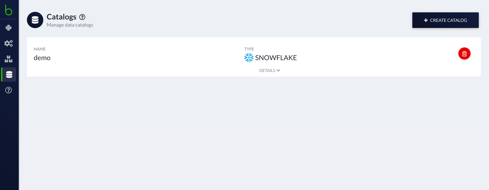
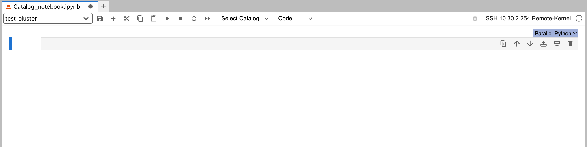
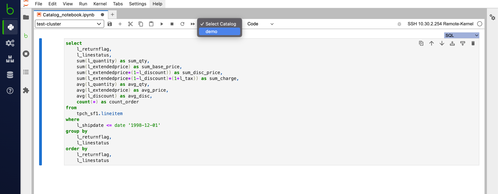

# Native SQL with Database Catalogs {#sql_catalog}


Database Catalogs are configuration objects that grant BodoSQL access to load tables from a remote database. 
Bodo platform now supports adding Database catalogs through the UI and provides users the option to write native
SQL code to run on the tables in the connected remote database.  


## Adding a Database Catalog

:fontawesome-brands-aws: Supported On AWS ·
:material-microsoft-azure:{.azure} Supported on Azure 


In your workspaces view, navigate to the _Catalogs_ section in the sidebar.
Click on _CREATE CATALOG_ and fill up the form with the required values.  

 


Currently, we only support Snowflake Database Catalogs on the Bodo Platform.  

Upon submitting the form, you will see that your Catalog has been created and is now
available to use in your interactive notebook. 




 
## Using Database Catalogs in Interactive Notebooks

:fontawesome-brands-aws: On AWS only ·
:octicons-beaker-24:{.beta} Experimental 

When you create a code cell in your interactive notebook, you will notice a blue selector on the
top right hand corner of the code cell. By default, this will be set to _Parallel-Python_.
This means that any code written in this cell will execute on all cores of the attached cluster. 



To enable running native SQL code, you can set the cell type in the blue selector to SQL, and you 
will need to select your Catalog from the Catalog selector to the left of the cell type selector as shown in the 
figure below. 



The output of the SQL query is automatically saved in a distributed dataframe named _LAST\_SQL\_OUTPUT_. This dataframe will be
overwritten every time a SQL query is run. 

!!! warning

    This is an experimental feature currently only available on AWS.
    
## Viewing Database Catalogs Data

To view the connection data stored in a catalog first connect to a cluster and then run the following in a code cell:

```python
import bodo_platform_utils
bodo_platform_utils.catalog.get_data("catalog_name")
```


!!! seealso "See Also"

    [Database Catalogs][database-catalogs], [BodoSDK Catalog API](https://pypi.org/project/bodosdk/#catalog)
