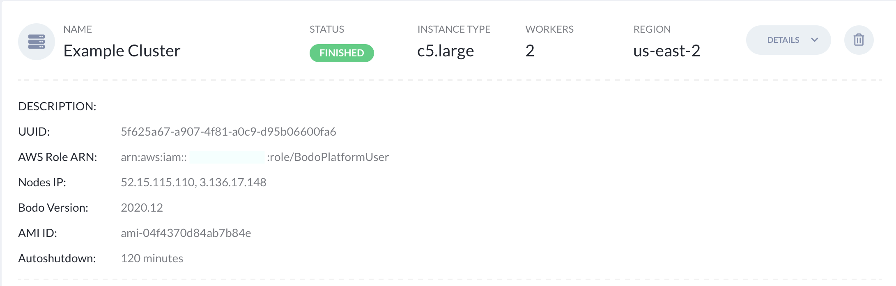

.. _bodo_platform:

Bodo Managed Cloud Platform on AWS
===================================

- :ref:`registration`
- :ref:`setting_aws_credentials`
- :ref:`creating_clusters`
- :ref:`attaching_notebook_to_cluster`
- :ref:`connecting_to_a_cluster`
- :ref:`running_a_job`
- :ref:`resources_created_in_aws_env`
- :ref:`aws_account_cleanup`
- :ref:`aws_billing`

.. _registration:

Registration
------------

a. Subscribe through the `AWS Marketplace <https://aws.amazon.com/marketplace/pp/B08NY29SMQ>`_.
#. After confirming your subscription, you'll be directed to Bodo Platform's registration page.
#. Fill out the fields with your information. If this is your individual account,
   use a unique name such as `firstname_lastname` for the Organization Name field.
#. Check the box for accepting terms and conditions and click on `SIGN UP`:

    .. image:: platform_onboarding_screenshots/signup.png
        :align: center
        :alt: Signup-Page

#. A page confirming that an activation link was sent to your email will appear.
   Please open the email and click on the activation link:

    .. image:: platform_onboarding_screenshots/signup-conf.png
        :align: center
        :alt: Signup-Page-Confirmation

   Clicking on the confirmation link will take you to the bodo platform page
   where you can use your newly created credentials to sign in:

        .. image:: platform_onboarding_screenshots/login.png
            :align: center
            :alt: Login-Page

.. _setting_aws_credentials:

Setting AWS Credentials
-----------------------

To use Bodo on AWS, you need to link your AWS account to the Bodo platform. This can be done either using the *Settings* page
in the left bar or the first item in the *Onboarding* list highlighted in green as shown in the picture below:

.. image:: platform_onboarding_screenshots/dashboard.png
    :align: center
    :alt: Dashboard

To be able to use the Bodo Platform to launch clusters and notebooks, you must grant it permission to access your AWS account and provision the
required resources in it. This can be done through an `AWS Cross Account IAM Role <https://docs.aws.amazon.com/AWSEC2/latest/UserGuide/iam-roles-for-amazon-ec2.html>`_ for the Bodo Platform.

.. _create_iam_role:

Create a Cross-Account IAM Role
~~~~~~~~~~~~~~~~~~~~~~~~~~~~~~~

There are two ways to create such an IAM Role, (a) you can create it manually, or (b) you can provide us with `Access Keys <https://docs.aws.amazon.com/IAM/latest/UserGuide/id_credentials_access-keys.html>`_
and we can create an IAM role in your AWS account. We provide directions for both these methods below.

.. _create_iam_role_manually:

Create the IAM Role Manually
****************************

#. Log in to the `AWS Management Console <https://aws.amazon.com/console/>`_  and navigate to the **IAM** Service.
#. Select the **Roles** tab in the sidebar, and click **Create Role**.
#. In `Select type of trusted entity`, select `Another AWS Account`.
#. Enter the Bodo Platform Account ID **481633624848** in the **Account ID** field.
#. Check the `Require external ID` option.

    .. image:: create_role_screenshots/create_iam_role_manual_form_step1.png
        :align: center
        :alt: Create Role Form Step 1

    In the **External ID** field, copy over the External ID from the `Settings` page on the Bodo Platform.    

    .. image:: create_role_screenshots/create_iam_role_manual_externalId.png
        :align: center
        :alt: External ID Platform

#. Click the `Next: Permissions` button.
#. Click the `Next: Tags` button.
#. Click the `Next: Review` button.
#. In the `Role name` field, enter a role name, e.g. `BodoPlatformUser`.

    .. image:: create_role_screenshots/create_iam_role_manual_review_step.png
        :align: center
        :alt: Create Role Form Review

#. Click `Create Role`. You will be taken back to the list of IAM Roles in your account.
#. In the list of IAM Roles, click on the role you just created.
#. Click on `Add inline policy`.

    .. image:: create_role_screenshots/create_role_manual_summary_page.png
        :align: center
        :alt: Create Role Summary Page

#. Click the `JSON` tab.

    .. image:: create_role_screenshots/create_iam_role_manual_policy_editor.png
        :align: center
        :alt: Create Role Manual Policy Editor

#. Bodo Cloud Platform requires a specific set of AWS permissions which are documented in :download:`Bodo-Platform Policy <downloadables/bodo-platform.json>`. 
   Paste the contents of the linked JSON file into the policy editor. 
#. Click on `Review policy`.
#. In the `Name` field, add a policy name, e.g. `Bodo-Platform-User-Policy`. Click on `Create policy`. You will be taken back to the Role Summary.
#. From the role summary, copy the **Role ARN**. This is the value that you will enter into the `Role ARN` field on the Setting Page on the Bodo Platform.

    .. image:: create_role_screenshots/create_iam_role_manual_final_summary.png
        :align: center
        :alt: Create Role Final Summary

.. _create_iam_role_using_platform:

Let the Bodo Platform create the IAM Role
*****************************************

#. Follow the instructions from `AWS Account and Access Keys guide <https://docs.aws.amazon.com/powershell/latest/userguide/pstools-appendix-sign-up.html>`_
   to create/retrieve your AWS access key ID and secret access key.
#. Click on `Create Role For Me` below the `Role ARN` field on the Setting page. This will open up a panel.

    .. image:: create_role_screenshots/create_role_via_platform_create_role_button.png
        :align: center
        :alt: Create Role Button on Platform

#. Enter the Access Keys created in step 1 in the form and click on `CREATE ROLE`.

    .. image:: create_role_screenshots/create_role_via_platform_enter_access_keys.png
        :align: center
        :alt: Enter Access Keys to create role on Platform
    
   **NOTE**: We will **not** save the provided Access Keys for security reasons.

#. Click `OK` on the popup confirmation box.
#. We will use the provided Access Keys to create an IAM Role in your AWS Account. 
#. The created Role ARN will be displayed on the same form.

    .. image:: create_role_screenshots/create_role_via_platform_generated_role.png
        :align: center
        :alt: Role ARN generated on the Platform

#. Copy the generated `Role ARN`. This is the value that you will enter into the `Role ARN` field on the Setting Page on the Bodo Platform.
#. In some cases, this role creation might fail. This could happen due to various reasons.
   
   a. A role already exists: In this case, please open the `AWS Management Console <https://aws.amazon.com/console/>`_, and navigate to the **IAM** Service. 
      Click on `Roles` in the sidebar. Look for a Role named `BodoPlatformUser`. Click on the role, and copy over the
      `Role ARN` from the role summary. Alternatively, you can delete the existing role from the AWS Console and then try to create
      an IAM role again via the Bodo Platform. This will ensure you have the role set up with the correct permissions.
      
      **Note**: If this is a shared AWS Account, ensure that no one else is actively using this IAM Role before deleting it.
   #. Provided access keys are not valid: Please ensure that valid access keys are provided.
   #. Provided access keys don't have the right permissions to create a role: Please ensure that the provided access keys have the permissions required
      to create an IAM Role.
   
   If none of these work, try creating the IAM Role manually as described in :ref:`create_iam_role_manually`.

Once you have generated an IAM Role using either of the methods described above, you are now ready to fill the Setting Form on the Bodo Platform.

#. Follow the instructions on `AWS Account ID guide <https://docs.aws.amazon.com/IAM/latest/UserGuide/console_account-alias.html>`_
   to retrieve your AWS account ID, and enter it in the **AWS Account ID** field in the Settings Form on the Bodo Platform.

#. Enter the `Role ARN` created using one of the above options into the `Role ARN` field in the Settings Form.

#. Select a region from the dropdown list. This is the region that your resources will be deployed in by default.

#. Click on *SAVE*.

You can see the progress on granting `AMI <https://docs.aws.amazon.com/AWSEC2/latest/UserGuide/AMIs.html>`_
launch permissions to your account ID in the `AMI Share Status` field. Your account is ready when it turns green.

**Note:** We grant AMI launch permissions to your account in the following AWS regions: us-east-1, us-east-2, us-west-1 & us-west-2.

**Note:** It is highly recommended that you ensure sufficient limits on your AWS account to launch
resources. See :ref:`resources_created_in_aws_env` for the resources required for Bodo Cloud Platform.

.. _creating_clusters:

Creating Clusters
-----------------

In the left bar click on *Clusters* (or click on the second step in the *Onboarding* list):

.. image:: platform_onboarding_screenshots/side-clusters.png
    :align: center
    :alt: Sidebar-Clusters
    :scale: 25

This will take you to the *Clusters* page. At the top right corner, click on
*Create Cluster* which opens the cluster creation form. First, choose a name for your cluster and
check the `EFA <https://aws.amazon.com/hpc/efa/>`_ checkbox if you want to use EFA-enabled nodes.
Then, select the type of nodes in the cluster to be created from the *Instance type* dropdown list.

**Note:** If the *Instance type* dropdown list does not populate, either the AWS
credentials are not entered properly or they are not valid.
Please go back to :ref:`setting_aws_credentials` and make sure you complete it with valid credentials.

Next, enter the number of nodes for your cluster in *Number of Instances*.
and choose the Bodo Version to be installed on your cluster. Typically the three latest Bodo Releases
are available.

**Note:** If the *Bodo Version* dropdown list does not populate, either the AWS
credentials are not entered properly or the permissions to Bodo's AMIs have not been granted to your account.
Please go back :ref:`setting_aws_credentials` and make sure you complete it with valid credentials and that
AMIs have been successfully shared with your AWS account.

Then, select a value for *Cluster auto shutdown*. This is the amount of time of inactivity after which
the platform will remove the cluster automatically. Activity is determined through attached notebooks (see :ref:`attaching_notebook_to_cluster`) 
and jobs (see :ref:`running_a_job`). Therefore, if you don't plan to attach a notebook or a job to this cluster 
(and use it via `ssh` instead), it's recommended to set this to `Never`, since otherwise the cluster will 
be removed after the set time.

.. image:: platform_onboarding_screenshots/cluster-form.png
    :align: center
    :alt: Cluster-creation-form

Finally click on `CREATE`.
You will see that a new task for creating the cluster has been created.

.. image:: platform_onboarding_screenshots/cluster-status-new.png
    :align: center
    :alt: Cluster-Status-New

The status is updated to *INPROGRESS* when the task starts executing and cluster creation is in progress.

.. image:: platform_onboarding_screenshots/cluster-status-ip.png
    :align: center
    :alt: Cluster-Status-InProgress

You can click on the *Details* drop down to monitor the progress for the cluster creation.

.. image:: platform_onboarding_screenshots/cluster-info.png
    :align: center
    :alt: Cluster-Info

Once the cluster is successfully created and ready to use, the status is updated to *FINISHED*.

.. image:: platform_onboarding_screenshots/cluster-status-done.png
    :align: center
    :alt: Cluster-Status-Finished

.. _attaching_notebook_to_cluster:

Attaching a Notebook to a Cluster
---------------------------------

Go to the notebooks page by clicking on *Notebooks* in the left bar (or on the third green step in the *Onboarding* list at the top).

.. image:: platform_onboarding_screenshots/side-nbs.png
    :align: center
    :alt: Sidebar-Notebooks
    :scale: 25

This will take you to the *Notebooks* page. At the top right corner, click on the *Create Notebook* button which opens
the notebook creation form.
Choose a name for your notebook and select
the type of node that will host the notebook
from the *Instance type* drop down list.
Note that this node is for running the Jupyter notebook itself, and will not run cluster workloads.
Lastly, select a cluster for attaching the notebook from the *Cluster* drop down menu and and click on `CREATE`.

.. image:: platform_onboarding_screenshots/nb-form.png
    :align: center
    :alt: Notebook-Creation-Form

After clicking `CREATE`, a new task for creating the notebook and its corresponding node is created.

.. image:: platform_onboarding_screenshots/nb-status-new.png
    :align: center
    :alt: Notebook-Status-New

The status updates to *INPROGRESS* when the task starts executing.

.. image:: platform_onboarding_screenshots/nb-status-ip.png
    :align: center
    :alt: Notebook-Status-InProgress

After creating the notebook, the platform runs AWS readiness probe checks:

.. image:: platform_onboarding_screenshots/nb-status-rp.png
    :align: center
    :alt: Notebook-Status-ReadinessProbe

The notebook is ready to use after all checks are complete.
*OPEN NOTEBOOK* will open the notebook in the current browser page,
while the dropdown allows opening the notebook in a new tab.

.. image:: platform_onboarding_screenshots/nb-status-done.png
    :align: center
    :alt: Notebook-Status-Finished

.. _connecting_to_a_cluster:

Connecting to a Cluster
-----------------------
We recommend interacting with clusters primarily through Jupyter
notebooks and Jobs. However, it may be necessary to connect directly to a 
cluster in some cases. You can either connect through a notebook terminal
(recommended), or ssh directly from your machine. The latter requires
providing your ssh public key during cluster creation.

Connecting with a Notebook Terminal
~~~~~~~~~~~~~~~~~~~~~~~~~~~~~~~~~~~
Follow the steps in :ref:`creating_clusters` and :ref:`attaching_notebook_to_cluster`
to attach a Notebook to a cluster.

Then, go the cluster tab and find your cluster. Click on `DETAILS` and copy the cluster `UUID`.

Next, go to the notebooks tab and select *OPEN NOTEBOOK*. In the `Launcher`, click
on `Terminal`.

.. image:: platform_onboarding_screenshots/notebook-terminal.png
    :align: center
    :alt: Notebook-Terminal

Through this terminal, you can interact with the ``/shared`` folder,
which is shared by all the instances in the cluster and the Notebook instance.
Follow the steps in :ref:`verify_your_connection`, to interact directly
with your cluster.

SSH From Your Machine
~~~~~~~~~~~~~~~~~~~~~
First, navigate to the clusters tabs and select `Create a Cluster`. Click on
`Show Advanced` and add your public key in `SSH Public Key`.
Then, click on ``Add your IP`` in the `Access from IP address` section to enable
accessing your cluster from your machine.

.. image:: platform_onboarding_screenshots/cluster-create-advanced-settings.png
    :align: center
    :alt: Cluster-Creation-Advanced-Settings

Fill the rest of the form by following the steps in :ref:`creating_clusters`.

In the clusters tab, select your cluster and click on `DETAILS` to find the list of IP
addresses for your cluster nodes. Use any of the IP addresses as the ssh
destination. In addition, also copy the cluster UUID which will be needed
to execute commands across the cluster.

In any ssh agent, you can connect to one of your nodes with::
   
   ssh -i <path_to_private_key> bodo@<IP_ADDRESS>

To add additional ssh options please refer to the documentation 
for your ssh agent.

.. _verify_your_connection:

Verify your Connection
~~~~~~~~~~~~~~~~~~~~~~

Once you have connected to a node in your cluster, you should verify that
you can run operations across all the instances in the cluster.

#. Verify the path to the hostfile for your cluster. You can find
   it by running::
      
      ls -la /shared/.hostfile-<CLUSTER UUID>

#. Check that you can run a command across you cluster. To do this, run::
   
      mpiexec -n <TOTAL_CORE_COUNT> -f /shared/.hostfile-<CLUSTER UUID> hostname
    
   This will print one line per each core in the cluster, with one unique hostname
   per cluster node. 
   
   
   Your cluster's `TOTAL_CORE_COUNT` is usually half the number of vCPUs on
   each instance times the number of instances in your cluster. For example,
   if you have a 4 instance cluster of c5.4xlarge, then your `TOTAL_CORE_COUNT`
   is 32.

#. Verify that you can run a python command across your cluster. For example, run::
      
      mpiexec -n <TOTAL_CORE_COUNT> -f /shared/.hostfile-<CLUSTER_UUID> python --version

If all commands succeed, you should be able to execute workloads across your cluster.
You can place scripts and small data that are shared across cluster nodes in ``/shared``.
However, external storage, such as S3, should be used for reading and writing large data.

.. _running_a_job:

Running a Job
-------------

Bodo Cloud Platform has support for running scheduled (and immediate)
Python jobs without the need for Jupyter Notebooks. To create a Job, navigate
to the Jobs page by selecting `Jobs` in the left bar.

.. image:: platform_onboarding_screenshots/side-jobs.png
    :align: center
    :alt: Sidebar-Jobs
    :scale: 25

This pages displays any *INPROGRESS* jobs you have previously
scheduled and allows you to schedule new Jobs. At the top right corner, click on
`CREATE JOB`. This opens a job creation form. 

First, select a name for your job and specify the cluster on
which you want to deploy your job. If you have an existing cluster
that is not currently bound to a notebook or another job, you can select this cluster from the dropdown menu.
Alternatively, you can create a cluster specifically for this job by selecting
the `NEW` button next to the cluster dropdown menu. When creating 
a cluster specifically for a job, note that the cluster is only used for that job 
and is removed once the job completes. After selecting your cluster, indicate when you want your job 
to be executed in the `Schedule` section. Then, enter the `Command` that you want to execute inside this cluster.

**Note:** This command is automatically prepended with ``mpiexec -n <CORE_COUNT> python``. For example, 
to run a file ``ex.py`` with the argument 1, you would enter the command ``ex.py 1``.

To specify your source code location, fill in the `Path` line with a valid Git URL or S3 URI
that leads to a repository containing your code. 

**Note:** When selecting a GitHub URL, you should select the URL available at the top of your web browser
and NOT the path when cloning the repository, *i.e.* your path SHOULD NOT end in `.git`. If selecting an S3 URI,
your S3 bucket must be in the same region as your cluster.

.. image:: platform_onboarding_screenshots/jobs-form-standard.png
    :align: center
    :alt: Jobs-Forms-Standard

If you are cloning a private repository, you need to provide the platform with valid Git credentials to download your repository.
To do so, select `Show advanced` in the bottom right of the form. Then in `Workspace username`, enter your Git
username and in `Workspace password` enter either your password or a valid Github Access Token. The advanced options
also allow you to specify a particular commit or branch with `Workspace reference` and to load other custom environment
variables in `Other`.

**Note:** If your Github Account uses 2FA please use a Github Access Token to avoid any possible authentication issues.

Once your form is complete, select `CREATE` to begin your job. 

.. image:: platform_onboarding_screenshots/jobs-form-advanced.png
    :align: center
    :alt: Jobs-Forms-Advanced

Once you've provided all the necessary details, select `CREATE` to begin your job. You will see a *NEW* task
created in your jobs page.

.. image:: platform_onboarding_screenshots/jobs-new.png
    :align: center
    :alt: New-Job

If you created a cluster specifically for this job, a new cluster
will also appear in your clusters page.

.. image:: platform_onboarding_screenshots/jobs-cluster-inprogress.png
    :align: center
    :alt: New-Job-Cluster

Your job will begin once it reaches its scheduled time and any necessary clusters have been created.
Then your job will transition to being *INPROGRESS*.

.. image:: platform_onboarding_screenshots/jobs-inprogress.png
    :align: center
    :alt: InProgress-Job

At this point your job will execute your desired command. Once it finishes executing,
your job will transition to *FINISHED* status. You can find any stdout information 
that you may need by pressing `DETAILS` followed by `SHOW LOGS`. If a cluster was
specifically created for this job, it will be deleted after the job finishes.

.. image:: platform_onboarding_screenshots/jobs-finished.png
    :align: center
    :alt: Finished-Job

**Note:** Bodo DOES NOT preserve artifacts written to local storage. If you have any information that
you need to persist and later review, you should write to external storage, such as Amazon S3.
You may also write to stdout/stderr, but output logs may be truncated,
so it should not be considered reliable for large outputs that need to be read later.

.. _resources_created_in_aws_env:

Resources Created in Your AWS Environment
-----------------------------------------

Bodo deploys cluster/notebook resources in your own AWS environment to ensure
security of your data.
Below is a list of AWS resources
that the Bodo Platform creates in your account to enable clusters and notebooks.

.. list-table::
  :header-rows: 1

  * - AWS Service
    - Purpose
  * - `EC2 Instances <https://aws.amazon.com/ec2/>`_
    - Cluster/notebook workers
  * - `EFS <https://aws.amazon.com/efs/>`_
    - Shared file system for clusters
  * - `VPC <https://aws.amazon.com/vpc/>`_, `Subnets <https://docs.aws.amazon.com/vpc/latest/userguide/VPC_Subnets.html>`_,
      `NAT Gateway <https://docs.aws.amazon.com/vpc/latest/userguide/vpc-nat-gateway.html>`_,
      `Elastic IP <https://docs.aws.amazon.com/AWSEC2/latest/UserGuide/elastic-ip-addresses-eip.html>`_,
      `ENI <https://docs.aws.amazon.com/AWSEC2/latest/UserGuide/using-eni.html>`_,
      `Security Groups <https://docs.aws.amazon.com/vpc/latest/userguide/VPC_SecurityGroups.html>`_, ...
    - Secure networking for clusters/notebooks
  * - `S3 <https://aws.amazon.com/s3/>`_ and `Dynamo DB <https://aws.amazon.com/dynamodb/>`_
    - Resource states
  * - `AWS Systems Manager <https://aws.amazon.com/systems-manager/>`_
    - Managing EC2 instances
  * - `KMS <https://aws.amazon.com/kms/>`_
    - Cluster secrets (e.g. SSH keys)
  * - `IAM Role <https://docs.aws.amazon.com/IAM/latest/UserGuide/id_roles.html>`_ for Clusters
    - Allow cluster workers to access resources above

.. note::

    These resources incur additional AWS infrastructure charges and are not included in the Bodo Platform charges.

.. _aws_account_cleanup:

AWS Account Cleanup
-------------------

As explained in :ref:`resources_created_in_aws_env`, the platform creates two types of resources in the users' AWS environments: 
organization level resources and cluster specific resources. The organization level resources are created by the platform to set 
up shared resources (such as a VPC, an EFS Mount, etc) that are used later by all created resources. The cluster specific resources 
(such as EC2 instances, ENIs, etc) are created by the platform to host/manage a specific cluster. This includes notebooks and 
corresponding resources as well.
The cluster specific resources are removed when you request a cluster to be removed.
The organization level resources persist in the user account so they can be used by clusters deployed in the future.
However, if you need to remove these resources for any reason (AWS limits, etc.), an option to do so is provided.
Navigate to the *Settings* page and click on `Show Advanced` in the bottom-right corner. 

.. image:: platform_onboarding_screenshots/settings-ac-cleanup.png
    :align: center
    :alt: Settings-Account-Cleanup

This will bring up a section called `AWS Resource Cleanup`. 

.. image:: platform_onboarding_screenshots/settings-adv-ac-cleanup.png
    :align: center
    :alt: Advanced-Settings-Account-Cleanup

Select the region from which you would like to remove these resources
(i.e. the region in which the resources you want to delete have been created), and click `CLEANUP AWS RESOURCES`.
Note that this will only work if you don't have any active clusters in that region deployed through the platform.
Else, the request will be rejected, and you'll be asked to remove all clusters in that region before trying again.
Removing active clusters (including clusters with a *FAILED* status) is necessary because 
this process will make them inaccessible to the platform.

.. seealso:: :ref:`troubleshootingaws`

.. _aws_billing:

Billing
-------

Users subscribed to the Bodo Platform through the AWS Marketplace will be charged for their use of the platform as part
of their regular AWS bill. The platform charges are based on the type of instances deployed and the duration of their usage (to the nearest minute).
The hourly rate for the supported instance types can be found on our `website <https://bodo.ai/aws-pricing>`_.
For any cluster deployed through the platform, users are charged starting from when the cluster has been successfully deployed, 
until the time the user requests the cluster to be removed. 

**Note:** Users are not charged in case of failures in cluster creation.

As mentioned previously in :ref:`resources_created_in_aws_env`, the AWS resources set up by the platform in your AWS environment
incur additional AWS infrastructure charges, and are not included in the Bodo Platform charges.