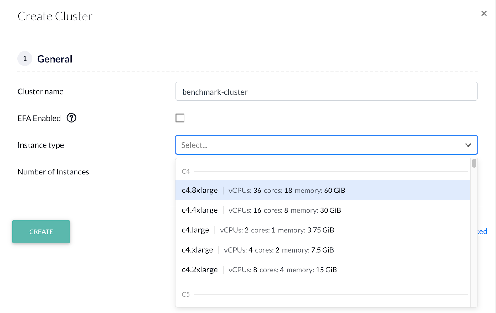
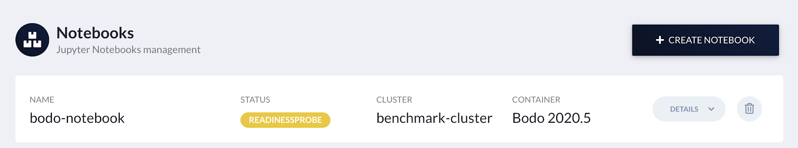

.. _bodo_platform:

Bodo Cloud Platform
===================

This page descibes how to use the Bodo Cloud Platform, including registration, cluster creation and notebook attachment.

Registration
------------

a. Follow the registration link provided by a Bodo team member.
b. Fill out the fields with your information. If this is your individual account,
   use a unique name such as `firstname_lastname` for the Organization Name field.
c. Check the box for accepting terms and conditions and click on `SIGN UP`:

    .. image:: platform_onboarding_screenshots/signup.png
        :align: center
        :alt: Signup-Page

d. A page confirming that an activation link was sent to your email will appear.
   Please open the email and click on the activation link:

    .. image:: platform_onboarding_screenshots/signup-conf.png
        :align: center
        :alt: Signup-Page-Confirmation

  Clicking on the confirmation link will take you to the bodo platform page
  where you can use your newly created credentials to sign in:

        .. image:: platform_onboarding_screenshots/login.png
            :align: center
            :alt: Login-Page

.. _setting_aws_credentials:

Setting AWS Credentials
-----------------------

The next step is to link your AWS account to the Bodo platform. This can be done either using the *Settings* page
in the left bar or the first item in the *Onboarding* list highlighted in green as shown in the picture below:

.. image:: platform_onboarding_screenshots/dashboard.png
    :align: center
    :alt: Dashboard

Follow the instructions from `AWS Account and Access Keys guide <https://docs.aws.amazon.com/powershell/latest/userguide/pstools-appendix-sign-up.html>`_
to create/retrieve your AWS access key and access secret key, and `AWS Account ID guide <https://docs.aws.amazon.com/IAM/latest/UserGuide/console_account-alias.html>`_
to retrieve your AWS account ID.

Bodo Cloud Platform requires a minimal set of AWS permissions which are documented in :download:`Minimal Bodo-Platform Policy <downloadables/bodo-platform.json>`.

1. Create a policy from this :download:`Minimal Bodo-Platform Policy <downloadables/bodo-platform.json>` using the AWS-CLI as follows:

.. code-block:: bash

    aws iam create-policy --policy-name {POLICY_NAME} --policy-document file://{path-to-bodo-platform.json-file}

For instance:

.. code-block:: bash

    aws iam create-policy --policy-name bodo-platform --policy-document file:///Users/johndoe/Downloads/bodo-platform.json

2. Attach this policy to the specific user or group that will be used to generate the keys for the Bodo platform (using the AWS console for instance, in IAM --> Access Management --> Policies).

Enter your created credentials and account ID and click on *SAVE*.
Refresh and you can see the progress on granting `AMI <https://docs.aws.amazon.com/AWSEC2/latest/UserGuide/AMIs.html>`_
launch permissions to your account ID. Your account is ready when it turns green.

Creating Clusters
-----------------

In the left bar click on *Clusters* (or click on the second step in the *Onboarding* list):

.. image:: platform_onboarding_screenshots/side-clusters.png
    :align: center
    :alt: Sidebar-Clusters
    :scale: 25

This will take you to the *Clusters* page. At the top right corner, click on
*Create Cluster* which opens the cluster creation form. First, choose a name for your cluster and
check the `EFA <https://aws.amazon.com/hpc/efa/>`_ checkbox if you want to use EFA-enabled nodes.
Then, select the type of nodes in the cluster to be created from the *Instance type* dropdown list.

**Note:** If the *Instance type* dropdown list does not populate, either the AWS
credentials are not entered properly or they are not valid.
Please go back :ref:`setting_aws_credentials` and make sure you complete it with valid credentials.

Finally, enter the number of nodes for your
cluster in *Number of Instances* and click on `CREATE`.
You will see that a new task for creating the cluster has been created.

.. image:: platform_onboarding_screenshots/cluster-status-new.png
    :align: center
    :alt: Cluster-Status-New

The status is updated to *INPROGRESS* when the task starts executing and cluster creation is in progress.

.. image:: platform_onboarding_screenshots/cluster-status-ip.png
    :align: center
    :alt: Cluster-Status-InProgress

You can click on the *Details* drop down to monitor the progress for the cluster creation.

.. image:: platform_onboarding_screenshots/cluster-info.png
    :align: center
    :alt: Cluster-Info

Once the cluster is successfully created and ready to use, the status is updated to *FINISHED*.

.. image:: platform_onboarding_screenshots/cluster-status-done.png
    :align: center
    :alt: Cluster-Status-Finished

Attaching a Notebook to a Cluster
---------------------------------

Go to the notebooks page by clicking on *Notebooks* in the left bar (or on the third green step in the *Onboarding* list at the top).

.. image:: platform_onboarding_screenshots/side-nbs.png
    :align: center
    :alt: Sidebar-Notebooks
    :scale: 25

This will take you to the *Notebooks* page. At the top right corner, click on the *Create Notebook* which opens
the notebook creation form.
Choose a name for your notebook and select
the type of node that will host the notebook
from the *Instance type* drop down list.
Note that this node is for running the Jupyter notebook itself, and will not run cluster workloads.
Lastly, select a cluster for attaching the notebook from the *Cluster* drop down menu and and click on `CREATE`.

.. image:: platform_onboarding_screenshots/nb-form.png
    :align: center
    :alt: Notebook-Creation-Form

After clicking `CREATE`, a new task for creating the notebook and its corresponding node is created.

.. image:: platform_onboarding_screenshots/nb-status-new.png
    :align: center
    :alt: Notebook-Status-New

The status updates to *INPROGRESS* when the task starts executing.

.. image:: platform_onboarding_screenshots/nb-status-ip.png
    :align: center
    :alt: Notebook-Status-InProgress

After creating the notebook, the platform runs AWS readiness probe checks:

The notebook is ready to use after all checks are complete.
*OPEN NOTEBOOK* will open the notebook in the current browser page,
while the dropdown allows opening the notebook in a new tab.

.. image:: platform_onboarding_screenshots/nb-status-done.png
    :align: center
    :alt: Notebook-Status-Finished
