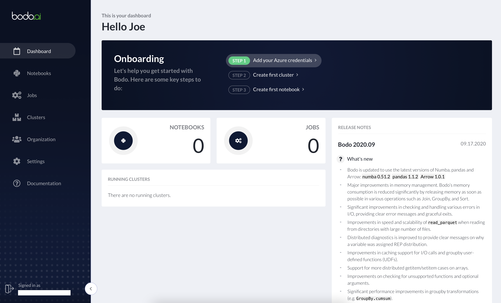
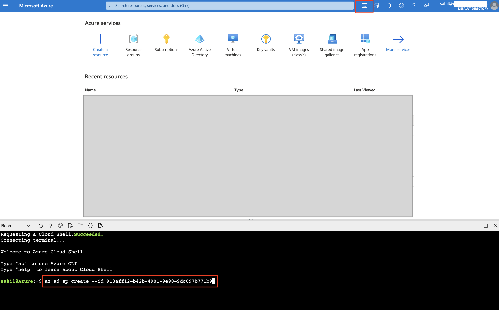
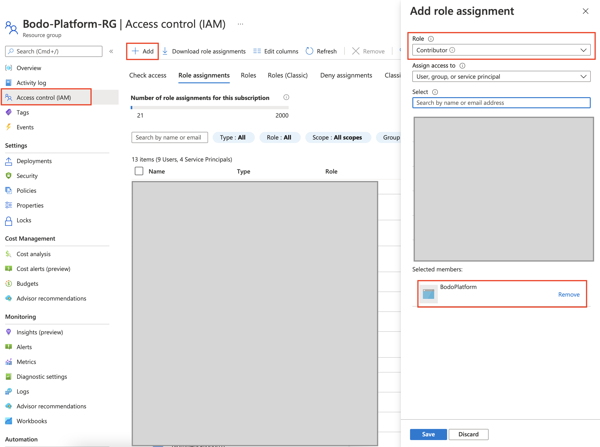
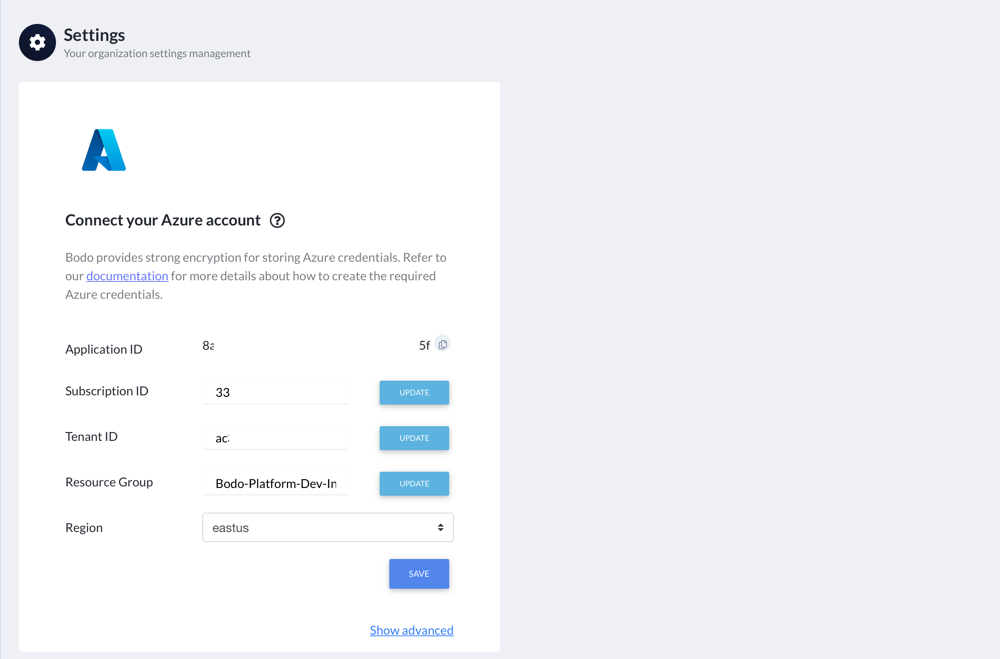
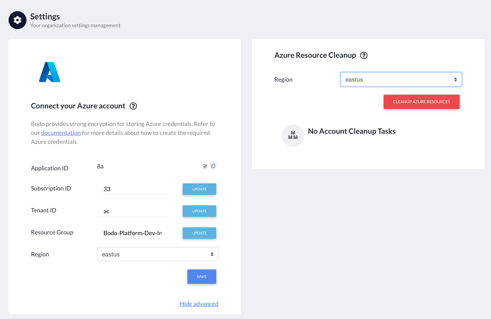
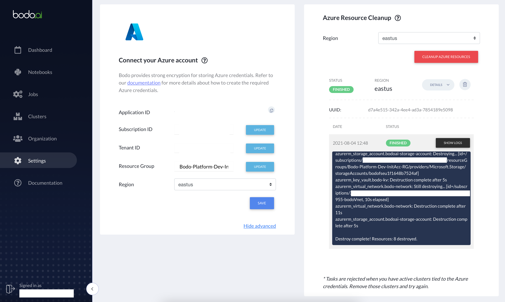

.. _bodo_platform_azure:

Bodo Managed Cloud Platform on Azure
====================================

- :ref:`registration`
- :ref:`setting_azure_credentials`
- :ref:`creating_clusters`
- :ref:`attaching_notebook_to_cluster`
- :ref:`connecting_to_a_cluster`
- :ref:`running_a_job`
- :ref:`resources_created_in_azure_env`
- :ref:`azure_account_cleanup`

.. _registration:

Registration
------------

a. `Contact Bodo <https://bodo.ai/contact>`_ to be onboarded onto Bodo Cloud Platform on Azure. You will be provided with an onboarding link.
#. The provided link will take you to Bodo Platform's registration page.
#. Fill out the fields with your information. If this is your individual account,
   use a unique name such as `firstname_lastname` for the **Organization Name** field.
#. Check the box for accepting terms and conditions and click on ``SIGN UP``:

    .. image:: platform_onboarding_screenshots/signup.png
        :align: center
        :alt: Signup-Page

#. A page confirming that an activation link was sent to your email will appear.
   Please open the email and click on the activation link:

    .. image:: platform_onboarding_screenshots/signup-conf.png
        :align: center
        :alt: Signup-Page-Confirmation

   Clicking on the confirmation link will take you to the bodo platform page
   where you can use your newly created credentials to sign in:

        .. image:: platform_onboarding_screenshots/login.png
            :align: center
            :alt: Login-Page

.. _setting_azure_credentials:

Setting Azure Credentials
-------------------------

To use Bodo on Azure, you need to link your Azure account to the Bodo platform. This can be done either using the *Settings* page
in the left bar or the first item in the *Onboarding* list highlighted in green as shown in the picture below:

In order to use the Bodo Platform to launch clusters and notebooks, you must grant it permission to access your Azure account and provision the
required resources in it. You can do this by creating a `Service Principal <https://docs.microsoft.com/en-us/azure/active-directory/develop/app-objects-and-service-principals>`_ for the Bodo Platform application and assigning a role to it.

.. _create_service_principal:

Create a Service Principal
~~~~~~~~~~~~~~~~~~~~~~~~~~

Login to your Azure Portal. Click on the icon next to the search bar to open a *Cloud-Shell*.
Execute the following command to create a service principal::

    az ad sp create --id APP_ID

where `APP_ID` is the Application ID for Bodo-Platform which is displayed on the *Settings* Page.

Once you have created a service principal, you need to assign a role to it. You can assign a role to this service principal at either
a subscription level or a resource group level. Subscription level permissions are only required if you want Bodo to create a new
resource group. If you provide an existing resource group, only permissions at the resource group level are required. As shown below,
go to the IAM section of your subscription or resource group and add a `Contributor` Role to the service principal you created
for the Bodo Platform Application.

Once you have created the service principal and assigned a role to it, you are now ready to fill the *Settings* Form on the Bodo Platform.

#. Enter your Azure Subscription ID in the **Subscription ID** field. You can find this in the *Subscription Overview*. 

    .. image:: platform_onboarding_screenshots/az-subscription-id.png
        :align: center
        :alt: Azure Subscription ID

#. Enter your Azure Tenant ID in the **Tenant ID** field. You can find this in *Azure AD*.

    .. image:: platform_onboarding_screenshots/az-tenant-id.png
        :align: center
        :alt: Azure Tenant ID

#. If you've given Bodo subscription level permissions and want Bodo to create a new resource group in your Azure subscription,
   enter the name of the resource group you want it to create in the **Resource Group** field. A suggested name is pre-filled 
   for you. If you've given Bodo resource group level permissions to an existing resource group, enter the name of this resource group.

#. Select a **region** from the dropdown list. This is the region that all Bodo resources will be deployed in.
   If you're providing an existing resource group, this must be the region this resource group is located in.

#. Click on ``SAVE``.

**Note:** It is highly recommended that you ensure sufficient limits on your Azure Subscription to launch
resources. See :ref:`resources_created_in_azure_env` for the resources required for Bodo Cloud Platform.

.. seealso:: :ref:`bodo_platform`

.. _resources_created_in_azure_env:

Resources Created in Your Azure Environment
-------------------------------------------

Bodo deploys cluster/notebook resources in your own Azure environment to ensure
security of your data.
Below is a list of Azure resources
that the Bodo Platform creates in your account to enable clusters and notebooks.

.. list-table::
  :header-rows: 1

  * - Azure Service
    - Purpose
  * - `Virtual Machines <https://azure.microsoft.com/en-us/services/virtual-machines/>`_
    - Cluster/notebook workers
  * - `Storage Accounts <https://azure.microsoft.com/en-us/product-categories/storage/>`_,
      `File-Shares <https://azure.microsoft.com/en-us/services/storage/files/>`_
    - Shared file system for clusters
  * - `Virtual Network with Subnets and NAT Gateway <https://azure.microsoft.com/en-us/services/virtual-network/>`_,
      `Public IP <https://docs.microsoft.com/en-us/azure/virtual-network/associate-public-ip-address-vm>`_,
      `NIC <https://docs.microsoft.com/en-us/azure/virtual-network/virtual-network-network-interface-vm>`_,
      `Security Groups <https://docs.microsoft.com/en-us/azure/virtual-network/network-security-groups-overview>`_, ...
    - Secure networking for clusters/notebooks
  * - `Blob Containers <https://azure.microsoft.com/en-us/services/storage/blobs/>`_,
    - Resource states
  * - `KeyVault <https://azure.microsoft.com/en-us/services/key-vault/>`_
    - Cluster secrets (e.g. SSH keys)
  * - `VM Identity <https://docs.microsoft.com/en-us/azure/active-directory/managed-identities-azure-resources/qs-configure-portal-windows-vm>`_ for Clusters
    - Allow cluster workers to access resources above

.. note::

    These resources incur additional Azure infrastructure charges and are not included in the Bodo Platform charges.

.. _azure_account_cleanup:

Azure Account Cleanup
---------------------

As explained in :ref:`resources_created_in_azure_env`, the platform creates two types of resources in the users' Azure environments: 
organization level resources and cluster specific resources. Organization level resources are created by the platform to set 
up shared resources (such as a VNets, File-Share, etc) that are used later by all created resources. Cluster specific resources 
(such as virtual machines, NICs, etc) are created by the platform to host/manage a specific cluster. This includes notebooks and 
corresponding resources as well.
The cluster specific resources are removed when you request a cluster to be removed.
The organization level resources persist in the user account so they can be used by clusters deployed in the future.
However, if you need to remove these resources for any reason (Azure resource limits, etc.), an option to do so is provided.
Navigate to the *Settings* page and click on ``Show Advanced`` in the bottom-right corner. 

This will bring up a section called *Azure Resource Cleanup*. 

Select the region from which you would like to remove these resources
(i.e. the region in which the resources you want to delete have been created), and click ``CLEANUP AZURE RESOURCES``.
Note that this will only work if you don't have any active clusters in that region deployed through the platform.
Else, the request will be rejected, and you'll be asked to remove all clusters in that region before trying again.
Removing active clusters (including clusters with a *FAILED* status) is necessary because 
this process will make them inaccessible to the platform.

The KeyVault deleted as part of this process needs to be purged manually through the `Azure Portal <https://portal.azure.com>`_
if you plan to create resources on the platform again. See :ref:`manually_purge_azure_kayvault`.

.. _manually_purge_azure_kayvault:

Manually Purge Azure Keyvault
~~~~~~~~~~~~~~~~~~~~~~~~~~~~~

Purging key vaults requires subscription level permissions. You can read more about this
`here <https://docs.microsoft.com/en-us/azure/key-vault/general/soft-delete-overview>`_ and
`here <https://docs.microsoft.com/en-us/azure/key-vault/general/key-vault-recovery>`_.
To avoid having to assign subscription level roles to
Bodo Platform's service principal, we require users to do this step manually. 

#. Navigate to *Key vaults* on your `Azure Portal <https://portal.azure.com>`_.

    .. image:: platform_onboarding_screenshots/az-manual-kv-purge-portal.png
        :align: center
        :alt: Azure Portal KVs

#. Click on ``Manage deleted vaults``. In the form, select the subscription associated with Bodo KeyVault to see a list of
   deleted key vaults. 

    .. image:: platform_onboarding_screenshots/az-manual-kv-purge-kvs.png
        :align: center
        :alt: Azure Portal KVs List
   
#. Select the key vault with `bodo` in its name, click on ``Purge`` and confirm by clicking ``Delete``.

    .. image:: platform_onboarding_screenshots/az-manual-kv-purge-step.png
        :align: center
        :alt: Azure Portal KV Purge Step

#. As shown in the notification, the purge process can take up to 10 minutes to complete. The purged key vault may continue to
   show up on the list of deleted key vaults until it has been successfully purged.

    .. image:: platform_onboarding_screenshots/az-manual-kv-purge-notification.png
      :align: center
      :alt: Azure Portal KV Purge Notification

#. Once the key vault has been successfully purged, the list of deleted keyvaults should not feature it. At this point you can
   use the Bodo Platform again to provision clusters, etc. 

    .. image:: platform_onboarding_screenshots/az-manual-kv-purge-completion.png
      :align: center
      :alt: Azure Portal KV Purge Completion

.. seealso:: :ref:`troubleshootingazure`
