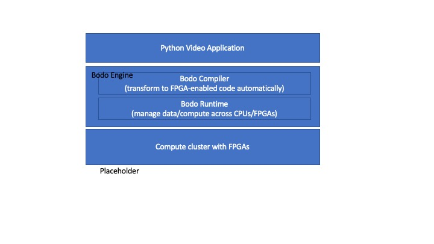

Real-time Video Encoding on FPGAs
=================================

High quality and efficient video encoding is critical for modern video streaming
services. Bodo and Xilinx are collaborating on a video encoding solution called
Efficient Elastic Ensemble (E3) that provides high quality encoding in real-time
at a fraction of total cost of ownership (TCO) of existing solutions.
E3 combines the simplicity of Python and efficiency of FPGA encoding using
Bodo's automatic parallelization, workload distribution, and accelerator management.

The figure below demonstrates the components of this solution:

#. The video application is written in standard Python code without any API changes.
#. The Bodo compiler recognizes the operations that can be offloaded to FPGAs and generates
   optimized FPGA-enabled parallel code.
#. The Bodo runtime manages data and computation across the FPGAs in the compute cluster.
#. The compute cluster can have any number of FPGAs which are fully managed by Bodo elastically.

    Efficient Elastic Ensemble (E3) Architecture

A simple E3 program has the following structure:

#. Load input video file
#. Process and encode the video
#. Write output video to file

Here is an example using Numpy to load an uncompressed video:

.. code:: ipython3

    @bodo.jit
    def process_video(raw_input_filename, encoded_output_filename):
        # load data
        data = np.fromfile(raw_input_filename, np.uint8)
        # reshape to array of frames
        data = data.reshape(len(data) // FRAME_SIZE, FRAME_SIZE)
        # compute output video
        result = ...
        # write output video
        result.tofile(encoded_output_filename)

This program is written as regular sequential Python and is parallelized
automatically by the JIT compiler. This enables fully elastic and scalable execution due to Bodo's transformations:

#. Bodo splits the input file read (``np.fromfile``) across processors to provide scalable I/O.
#. The reshape operation (``data.reshape``) is performed in parallel while handling the frame boundaries properly.
#. Computation is parallelized and offloaded to FPGA devices automatically.
#. The output is written to a file in parallel (``result.tofile``), which essentially "stitches" the data chunks together.

This page will include more details of supported APIs and operations as incorporated in future versions of Bodo.
