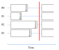

User Guide
======================

The previous section covered the basics of using Bodo.
In this section, we will explain core Bodo concepts in more detail, introduce
additional Bodo features and discuss more advanced topics.

Bodo Basics
-----------

.. _jit:

JIT (Just-in-time) Compilation Workflow
~~~~~~~~~~~~~~~~~~~~~~~~~~~~~~~~~~~~~~~

Bodo provides a just-in-time (JIT) compilation workflow using the
``@bodo.jit`` decorator, which replaces a Python function with a
so-called ``Dispatcher`` object. Bodo compiles the function the first
time a Dispatcher object is called and reuses the compiled version
afterwards. The function is recompiled only if the same function is
called with different argument types (not often in practice).

.. code:: ipython3

    import numpy as np
    import pandas as pd
    import bodo
    
    @bodo.jit
    def f(n, a):
        df = pd.DataFrame({"A": np.arange(n) + a})
        return df.head(3)
    
    print(f)
    print(f(8, 1))  # compiles for (int, int) input types
    print(f(8, 2))  # same input types, no need to compile
    print(f(8, 2.2))  # compiles for (int, float) input types

.. parsed-literal::

    CPUDispatcher(<function f at 0x7fa35e533c10>)
       A
    0  1
    1  2
    2  3
       A
    0  2
    1  3
    2  4
         A
    0  2.2
    1  3.2
    2  4.2

All of this is completely transparent to the caller, and does not affect
any Python code calling the function.

.. note::

   
   In many cases, the binary that Bodo generates when compiling a function can be saved to disk to be reused across program executions. See "Bodo Caching" below for more information.

Parallel Execution Model
~~~~~~~~~~~~~~~~~~~~~~~~

As we saw in the “Getting Started” tutorial, Bodo transforms functions
for parallel execution. However, the dispatcher does not launch
processes or threads on the fly. Instead, the Python application
(including non-Bodo code) is intended to be executed under an MPI Single
Program Multiple Data (`SPMD <https://en.wikipedia.org/wiki/SPMD>`__)
paradigm, where MPI processes are launched in the beginning and all run
the same code.

For example, we can save an example code in a file and use *mpiexec* to
launch 4 processes:

.. code:: ipython3

    import numpy as np
    import pandas as pd
    import bodo
    
    @bodo.jit(distributed=["df"])
    def f(n, a):
        df = pd.DataFrame({"A": np.arange(n) + a})
        return df
    
    print(f(8, 1))

.. code:: ipython3

    %save -f test_bodo.py 2 # cell number of previous cell

.. code:: ipython3

    !mpiexec -n 4 python test_bodo.py

.. parsed-literal::

       A
    2  3
    3  4
       A
    6  7
    7  8
       A
    4  5
    5  6
       A
    0  1
    1  2

In this example, ``mpiexec`` launches 4 Python processes, each of which
executes the same ``test_bodo.py`` file.

.. warning::

   

   - Python codes outside of Bodo functions execute sequentially on every process.
   - Bodo functions run in parallel assuming that Bodo is able to parallelize them. Otherwise, they also run sequentially on every process. Bodo warns if it does not find parallelism (more details later).

Note how the prints, which are regular Python code executed outside of
Bodo, run for each process.

On Jupyter notebook, parallel execution happens in very much the same
way. We start a set of MPI engines through ``ipyparallel`` and activate
a client (*NOTE: if you are using the Bodo Platform, this is already
done automatically*):

.. code:: ipython3

    import ipyparallel as ipp
    c = ipp.Client(profile="mpi")
    view = c[:]
    view.activate()
    view.block = True
    import os
    view["cwd"] = os.getcwd()
    %px cd $cwd

After this initialization, any code that we run in the notebook with
``%%px`` is sent for execution on all MPI engines.

.. code:: ipython3

    
    import numpy as np
    import pandas as pd
    import bodo
    
    @bodo.jit(distributed=["df"])
    def f(n):
        df = pd.DataFrame({"A": np.arange(n)})
        return df
    
    print(f(8))

.. parsed-literal::

    [stdout:0] 
       A
    0  0
    1  1
    [stdout:1] 
       A
    2  2
    3  3
    [stdout:2] 
       A
    4  4
    5  5
    [stdout:3] 
       A
    6  6
    7  7

Parallel APIs
~~~~~~~~~~~~~

Bodo provides a limited number of parallel APIs to support advanced
cases that may need them. The example below demonstrates getting the
process number from Bodo (called ``rank`` in MPI terminology) and the
total number of processes.

.. code:: ipython3

    
    # some work only on rank 0
    if bodo.get_rank() == 0:
        print("rank 0 done")
    
    # some work on every process
    print("rank", bodo.get_rank(), "here")
    print("total ranks:", bodo.get_size())

.. parsed-literal::

    [stdout:0] 
    rank 0 done
    rank 0 here
    total ranks: 4
    [stdout:1] 
    rank 1 here
    total ranks: 4
    [stdout:2] 
    rank 2 here
    total ranks: 4
    [stdout:3] 
    rank 3 here
    total ranks: 4

A common pattern is using barriers to make sure all processes see
side-effects at the same time. For example, a process can delete files
from storage while others wait before writing to file:

.. code:: ipython3

    import shutil, os
    import numpy as np
    
    # remove file if exists
    if bodo.get_rank() == 0:
        if os.path.exists("data/data.pq"):
            shutil.rmtree("data/data.pq")
    
    # make sure all processes are synchronized
    # (e.g. all processes need to see effect of rank 0's work)
    bodo.barrier()
    
    @bodo.jit
    def f(n):
        df = pd.DataFrame({"A": np.arange(n)})
        df.to_parquet("data/data.pq")
    
    f(10)

The following figure illustrates what happens when processes call
``bodo.barrier()``. When barrier is called, a process pauses and waits
until all other processes have reached the barrier:

   Process synchronization with Barrier

.. danger::

    The examples above show that it is possible to have each process follow a different control flow, but all processes must always call the same Bodo functions in the same order.

Data Distribution
-----------------

Bodo parallelizes computation by dividing data into separate chunks
across processes. However, some data handled by a Bodo function may not
be divided into chunks. There are are two main data distribution
schemes:

-  Replicated (*REP*): the data associated with the variable is the same
   on every process.
-  One-dimensional (*1D*): the data is divided into chunks, split along
   one dimension (rows of a dataframe or first dimension of an array).

Bodo determines distribution of variables automatically, using the
nature of the computation that produces them. Let’s see an example:

.. code:: ipython3

    
    @bodo.jit
    def mean_power_speed():
        df = pd.read_parquet("data/cycling_dataset.pq")
        m = df[["power", "speed"]].mean()
        return m
    
    res = mean_power_speed()
    print(res)

.. parsed-literal::

    [stdout:0] 
    power    102.078421
    speed      5.656851
    dtype: float64
    [stdout:1] 
    power    102.078421
    speed      5.656851
    dtype: float64
    [stdout:2] 
    power    102.078421
    speed      5.656851
    dtype: float64
    [stdout:3] 
    power    102.078421
    speed      5.656851
    dtype: float64

In this example, ``df`` is parallelized (each process reads a different
chunk) but ``m`` is replicated, even though it is a Series.
Semantically, it makes sense for the output of ``mean`` operation to be
replicated on all processors, since it is a reduction and produces
“small” data.

Distributed Diagnostics
~~~~~~~~~~~~~~~~~~~~~~~

The distributions found by Bodo can be printed either by setting the
environment variable ``BODO_DISTRIBUTED_DIAGNOSTICS=1`` or calling
``distributed_diagnostics()`` on the compiled function. Let’s examine
the previous example’s distributions:

.. code:: ipython3

    mean_power_speed.distributed_diagnostics()

.. parsed-literal::

    [stdout:0] 
    Distributed diagnostics for function mean_power_speed, <ipython-input-29-0669fd25a56c> (1)
    
    Data distributions:
       power.10770                1D_Block
       speed.10771                1D_Block
       $A.10860.11199             1D_Block
       $A.10923.11209             1D_Block
       $data.10832.11220          REP
       $12call_method.5.11183     REP
       $66call_method.31.10850    REP
       $m.11222                   REP
       $30return_value.12         REP
    
    Parfor distributions:
       31                   1D_Block
       30                   1D_Block
    
    Distributed listing for function mean_power_speed, <ipython-input-29-0669fd25a56c> (1)
    -------------------------------------------------------| parfor_id/variable: distribution
    @bodo.jit                                              | 
    def mean_power_speed():                                | 
        df = pd.read_parquet("data/cycling_dataset.pq")----| power.10770: 1D_Block, speed.10771: 1D_Block
        m = df[["power", "speed"]].mean()------------------| $A.10860.11199: 1D_Block, $A.10923.11209: 1D_Block
        return m-------------------------------------------| $30return_value.12: REP
    
    Distributed analysis replicated return variable $30return_value.12. Set distributed flag for the original variable if distributed partitions should be returned.
    

Variables are renamed due to optimization. The output shows that
``power`` and ``speed`` columns of ``df`` are distributed (``1D_Block``)
but ``m`` is replicated (``REP``). This is because ``df`` is output of
``read_parquet`` and input of ``mean``, both of which can be distributed
by Bodo. ``m`` is output of ``mean``, which is always replicated
(available on every process).

Function Arguments and Return Values
~~~~~~~~~~~~~~~~~~~~~~~~~~~~~~~~~~~~

Now let’s see what happens if we pass the data into the Bodo function as
a function parameter but don’t mark it as distributed:

.. code:: ipython3

    
    @bodo.jit
    def mean_power_speed(df):
        m = df[["power", "speed"]].mean()
        return m
    
    df = pd.read_parquet("data/cycling_dataset.pq")
    res = mean_power_speed(df)
    print(res)

.. parsed-literal::

    [stdout:0] 
    power    102.078421
    speed      5.656851
    dtype: float64
    [stdout:1] 
    power    102.078421
    speed      5.656851
    dtype: float64
    [stdout:2] 
    power    102.078421
    speed      5.656851
    dtype: float64
    [stdout:3] 
    power    102.078421
    speed      5.656851
    dtype: float64

.. parsed-literal::

    [stderr:0] 
    /Users/ehsan/dev/bodo/bodo/transforms/distributed_analysis.py:229: BodoWarning: No parallelism found for function 'mean_power_speed'. This could be due to unsupported usage. See distributed diagnostics for more information.
      warnings.warn(

The program runs and returns the same correct value as before, but
everything is replicated on all processes and *there is no parallelism!*
Bodo’s warning indicates this explicitly. Therefore, each process reads
the whole data file and calculates the mean of the dataframe
independently.

This is because data is passed to Bodo as argument without setting the
``distributed`` flag, and Bodo assumes correctly that the data is
replicated (note that the dataframe in this case is read using pandas).
Bodo then follows dependencies and replicates the whole program.

Similarly, return values will be replicated by default, since data is
passed to regular Python:

.. code:: ipython3

    import bodo
    import pandas as pd
    
    pd.options.display.max_columns = 7
    
    @bodo.jit
    def mean_power_speed():
        df = pd.read_parquet("data/cycling_dataset.pq")
        return df
    
    df = mean_power_speed()
    print(df)

.. parsed-literal::

    [stdout:0] 
          Unnamed: 0    altitude  cadence  ...  power  speed                time
    0              0  185.800003       51  ...     45  3.459 2016-10-20 22:01:26
    1              1  185.800003       68  ...      0  3.710 2016-10-20 22:01:27
    2              2  186.399994       38  ...     42  3.874 2016-10-20 22:01:28
    3              3  186.800003       38  ...      5  4.135 2016-10-20 22:01:29
    4              4  186.600006       38  ...      1  4.250 2016-10-20 22:01:30
    ...          ...         ...      ...  ...    ...    ...                 ...
    3897        1127  178.199997        0  ...      0  3.497 2016-10-20 23:14:31
    3898        1128  178.199997        0  ...      0  3.289 2016-10-20 23:14:32
    3899        1129  178.199997        0  ...      0  2.969 2016-10-20 23:14:33
    3900        1130  178.399994        0  ...      0  2.969 2016-10-20 23:14:34
    3901        1131  178.399994        0  ...      0  2.853 2016-10-20 23:14:35
    
    [3902 rows x 10 columns]
    [stdout:1] 
          Unnamed: 0    altitude  cadence  ...  power  speed                time
    0              0  185.800003       51  ...     45  3.459 2016-10-20 22:01:26
    1              1  185.800003       68  ...      0  3.710 2016-10-20 22:01:27
    2              2  186.399994       38  ...     42  3.874 2016-10-20 22:01:28
    3              3  186.800003       38  ...      5  4.135 2016-10-20 22:01:29
    4              4  186.600006       38  ...      1  4.250 2016-10-20 22:01:30
    ...          ...         ...      ...  ...    ...    ...                 ...
    3897        1127  178.199997        0  ...      0  3.497 2016-10-20 23:14:31
    3898        1128  178.199997        0  ...      0  3.289 2016-10-20 23:14:32
    3899        1129  178.199997        0  ...      0  2.969 2016-10-20 23:14:33
    3900        1130  178.399994        0  ...      0  2.969 2016-10-20 23:14:34
    3901        1131  178.399994        0  ...      0  2.853 2016-10-20 23:14:35
    
    [3902 rows x 10 columns]
    [stdout:2] 
          Unnamed: 0    altitude  cadence  ...  power  speed                time
    0              0  185.800003       51  ...     45  3.459 2016-10-20 22:01:26
    1              1  185.800003       68  ...      0  3.710 2016-10-20 22:01:27
    2              2  186.399994       38  ...     42  3.874 2016-10-20 22:01:28
    3              3  186.800003       38  ...      5  4.135 2016-10-20 22:01:29
    4              4  186.600006       38  ...      1  4.250 2016-10-20 22:01:30
    ...          ...         ...      ...  ...    ...    ...                 ...
    3897        1127  178.199997        0  ...      0  3.497 2016-10-20 23:14:31
    3898        1128  178.199997        0  ...      0  3.289 2016-10-20 23:14:32
    3899        1129  178.199997        0  ...      0  2.969 2016-10-20 23:14:33
    3900        1130  178.399994        0  ...      0  2.969 2016-10-20 23:14:34
    3901        1131  178.399994        0  ...      0  2.853 2016-10-20 23:14:35
    
    [3902 rows x 10 columns]
    [stdout:3] 
          Unnamed: 0    altitude  cadence  ...  power  speed                time
    0              0  185.800003       51  ...     45  3.459 2016-10-20 22:01:26
    1              1  185.800003       68  ...      0  3.710 2016-10-20 22:01:27
    2              2  186.399994       38  ...     42  3.874 2016-10-20 22:01:28
    3              3  186.800003       38  ...      5  4.135 2016-10-20 22:01:29
    4              4  186.600006       38  ...      1  4.250 2016-10-20 22:01:30
    ...          ...         ...      ...  ...    ...    ...                 ...
    3897        1127  178.199997        0  ...      0  3.497 2016-10-20 23:14:31
    3898        1128  178.199997        0  ...      0  3.289 2016-10-20 23:14:32
    3899        1129  178.199997        0  ...      0  2.969 2016-10-20 23:14:33
    3900        1130  178.399994        0  ...      0  2.969 2016-10-20 23:14:34
    3901        1131  178.399994        0  ...      0  2.853 2016-10-20 23:14:35
    
    [3902 rows x 10 columns]

.. parsed-literal::

    [stderr:0] 
    /Users/ehsan/dev/bodo/bodo/transforms/distributed_analysis.py:229: BodoWarning: No parallelism found for function 'mean_power_speed'. This could be due to unsupported usage. See distributed diagnostics for more information.
      warnings.warn(

.. warning::

    Bodo assumes that input parameters and return values are replicated, unless if specified using `distributed` flag. This can lead to replication of the whole program due to dependencies.

Passing Distributed Data to Bodo
~~~~~~~~~~~~~~~~~~~~~~~~~~~~~~~~

Bodo functions may require distributed arguments and return values in
some cases such as passing distributed data across Bodo functions. This
can be achieved using the ``distributed`` flag:

.. code:: ipython3

    
    @bodo.jit(distributed=["df"])
    def read_data():
        df = pd.read_parquet("data/cycling_dataset.pq")
        print("total size", len(df))
        return df
    
    @bodo.jit(distributed=["df"])
    def mean_power(df):
        x = df.power.mean()
        return x
    
    df = read_data()
    # df is a chunk of data on each process
    print("chunk size", len(df))
    res = mean_power(df)
    print(res)

.. parsed-literal::

    [stdout:0] 
    total size 3902
    chunk size 976
    102.07842132239877
    [stdout:1] 
    chunk size 976
    102.07842132239877
    [stdout:2] 
    chunk size 975
    102.07842132239877
    [stdout:3] 
    chunk size 975
    102.07842132239877

Scattering Data
~~~~~~~~~~~~~~~

One can distribute data manually by *scattering* data from one process
to all processes. For example:

.. code:: ipython3

    
    @bodo.jit(distributed=["df"])
    def mean_power(df):
        x = df.power.mean()
        return x
    
    df = None
    # only rank 0 reads the data
    if bodo.get_rank() == 0:
        df = pd.read_parquet("data/cycling_dataset.pq")
    
    df = bodo.scatterv(df)
    res = mean_power(df)
    print(res)

.. parsed-literal::

    [stdout:0] 102.07842132239877
    [stdout:1] 102.07842132239877
    [stdout:2] 102.07842132239877
    [stdout:3] 102.07842132239877

Gathering Data
~~~~~~~~~~~~~~

One can *gather* distributed data into a single process manually. For
example:

.. code:: ipython3

    
    @bodo.jit
    def mean_power():
        df = pd.read_parquet("data/cycling_dataset.pq")
        return bodo.gatherv(df)
    
    df = mean_power()
    print(df)

.. parsed-literal::

    [stdout:0] 
          Unnamed: 0    altitude  cadence  ...  power  speed                time
    0              0  185.800003       51  ...     45  3.459 2016-10-20 22:01:26
    1              1  185.800003       68  ...      0  3.710 2016-10-20 22:01:27
    2              2  186.399994       38  ...     42  3.874 2016-10-20 22:01:28
    3              3  186.800003       38  ...      5  4.135 2016-10-20 22:01:29
    4              4  186.600006       38  ...      1  4.250 2016-10-20 22:01:30
    ...          ...         ...      ...  ...    ...    ...                 ...
    3897        1127  178.199997        0  ...      0  3.497 2016-10-20 23:14:31
    3898        1128  178.199997        0  ...      0  3.289 2016-10-20 23:14:32
    3899        1129  178.199997        0  ...      0  2.969 2016-10-20 23:14:33
    3900        1130  178.399994        0  ...      0  2.969 2016-10-20 23:14:34
    3901        1131  178.399994        0  ...      0  2.853 2016-10-20 23:14:35
    
    [3902 rows x 10 columns]
    [stdout:1] 
    Empty DataFrame
    Columns: [Unnamed: 0, altitude, cadence, distance, hr, latitude, longitude, power, speed, time]
    Index: []
    
    [0 rows x 10 columns]
    [stdout:2] 
    Empty DataFrame
    Columns: [Unnamed: 0, altitude, cadence, distance, hr, latitude, longitude, power, speed, time]
    Index: []
    
    [0 rows x 10 columns]
    [stdout:3] 
    Empty DataFrame
    Columns: [Unnamed: 0, altitude, cadence, distance, hr, latitude, longitude, power, speed, time]
    Index: []
    
    [0 rows x 10 columns]

Alternatively, distributed data can be gathered and sent to all
processes, effectively replicating the data:

.. code:: ipython3

    
    @bodo.jit
    def mean_power():
        df = pd.read_parquet("data/cycling_dataset.pq")
        return bodo.allgatherv(df)
    
    df = mean_power()
    print(df)

.. parsed-literal::

    [stdout:0] 
          Unnamed: 0    altitude  cadence  ...  power  speed                time
    0              0  185.800003       51  ...     45  3.459 2016-10-20 22:01:26
    1              1  185.800003       68  ...      0  3.710 2016-10-20 22:01:27
    2              2  186.399994       38  ...     42  3.874 2016-10-20 22:01:28
    3              3  186.800003       38  ...      5  4.135 2016-10-20 22:01:29
    4              4  186.600006       38  ...      1  4.250 2016-10-20 22:01:30
    ...          ...         ...      ...  ...    ...    ...                 ...
    3897        1127  178.199997        0  ...      0  3.497 2016-10-20 23:14:31
    3898        1128  178.199997        0  ...      0  3.289 2016-10-20 23:14:32
    3899        1129  178.199997        0  ...      0  2.969 2016-10-20 23:14:33
    3900        1130  178.399994        0  ...      0  2.969 2016-10-20 23:14:34
    3901        1131  178.399994        0  ...      0  2.853 2016-10-20 23:14:35
    
    [3902 rows x 10 columns]
    [stdout:1] 
          Unnamed: 0    altitude  cadence  ...  power  speed                time
    0              0  185.800003       51  ...     45  3.459 2016-10-20 22:01:26
    1              1  185.800003       68  ...      0  3.710 2016-10-20 22:01:27
    2              2  186.399994       38  ...     42  3.874 2016-10-20 22:01:28
    3              3  186.800003       38  ...      5  4.135 2016-10-20 22:01:29
    4              4  186.600006       38  ...      1  4.250 2016-10-20 22:01:30
    ...          ...         ...      ...  ...    ...    ...                 ...
    3897        1127  178.199997        0  ...      0  3.497 2016-10-20 23:14:31
    3898        1128  178.199997        0  ...      0  3.289 2016-10-20 23:14:32
    3899        1129  178.199997        0  ...      0  2.969 2016-10-20 23:14:33
    3900        1130  178.399994        0  ...      0  2.969 2016-10-20 23:14:34
    3901        1131  178.399994        0  ...      0  2.853 2016-10-20 23:14:35
    
    [3902 rows x 10 columns]
    [stdout:2] 
          Unnamed: 0    altitude  cadence  ...  power  speed                time
    0              0  185.800003       51  ...     45  3.459 2016-10-20 22:01:26
    1              1  185.800003       68  ...      0  3.710 2016-10-20 22:01:27
    2              2  186.399994       38  ...     42  3.874 2016-10-20 22:01:28
    3              3  186.800003       38  ...      5  4.135 2016-10-20 22:01:29
    4              4  186.600006       38  ...      1  4.250 2016-10-20 22:01:30
    ...          ...         ...      ...  ...    ...    ...                 ...
    3897        1127  178.199997        0  ...      0  3.497 2016-10-20 23:14:31
    3898        1128  178.199997        0  ...      0  3.289 2016-10-20 23:14:32
    3899        1129  178.199997        0  ...      0  2.969 2016-10-20 23:14:33
    3900        1130  178.399994        0  ...      0  2.969 2016-10-20 23:14:34
    3901        1131  178.399994        0  ...      0  2.853 2016-10-20 23:14:35
    
    [3902 rows x 10 columns]
    [stdout:3] 
          Unnamed: 0    altitude  cadence  ...  power  speed                time
    0              0  185.800003       51  ...     45  3.459 2016-10-20 22:01:26
    1              1  185.800003       68  ...      0  3.710 2016-10-20 22:01:27
    2              2  186.399994       38  ...     42  3.874 2016-10-20 22:01:28
    3              3  186.800003       38  ...      5  4.135 2016-10-20 22:01:29
    4              4  186.600006       38  ...      1  4.250 2016-10-20 22:01:30
    ...          ...         ...      ...  ...    ...    ...                 ...
    3897        1127  178.199997        0  ...      0  3.497 2016-10-20 23:14:31
    3898        1128  178.199997        0  ...      0  3.289 2016-10-20 23:14:32
    3899        1129  178.199997        0  ...      0  2.969 2016-10-20 23:14:33
    3900        1130  178.399994        0  ...      0  2.969 2016-10-20 23:14:34
    3901        1131  178.399994        0  ...      0  2.853 2016-10-20 23:14:35
    
    [3902 rows x 10 columns]

Parallel I/O
------------

.. figure:: ../img/file-read.jpg
   :align: center
   :alt: Bodo reads file chunks in parallel

   Bodo reads file chunks in parallel

Efficient parallel data processing requires data I/O to be parallelized
effectively as well. Bodo provides parallel file I/O for many different
formats such as `Parquet <http://parquet.apache.org>`__, CSV, JSON,
Numpy binaries, `HDF5 <http://www.h5py.org>`__ and SQL databases. This
diagram demonstrates how chunks of data are partitioned among parallel
execution engines by Bodo.

Parquet
~~~~~~~

Parquet is a commonly used file format in analytics due to its efficient
columnar storage. Bodo supports the standard pandas API for reading
Parquet:

.. code:: ipython3

    import pandas as pd
    import bodo
    
    @bodo.jit(distributed=["df"])
    def pq_read():
        df = pd.read_parquet("data/cycling_dataset.pq")
        return df
    
    # on each process, this returns the data chunk read by that process
    res = pq_read()
    if bodo.get_rank() == 0:
        print(res)  # display results of first process only

.. parsed-literal::

    [stdout:0] 
         Unnamed: 0    altitude  cadence  ...  power  speed                time
    0             0  185.800003       51  ...     45  3.459 2016-10-20 22:01:26
    1             1  185.800003       68  ...      0  3.710 2016-10-20 22:01:27
    2             2  186.399994       38  ...     42  3.874 2016-10-20 22:01:28
    3             3  186.800003       38  ...      5  4.135 2016-10-20 22:01:29
    4             4  186.600006       38  ...      1  4.250 2016-10-20 22:01:30
    ..          ...         ...      ...  ...    ...    ...                 ...
    971         971  132.399994        0  ...      1  4.385 2016-10-20 22:20:32
    972         972  132.199997        0  ...      1  4.122 2016-10-20 22:20:33
    973         973  132.199997        0  ...    283  4.715 2016-10-20 22:20:34
    974         974  132.399994       70  ...     98  5.161 2016-10-20 22:20:35
    975         975  132.399994      115  ...      1  5.155 2016-10-20 22:20:36
    
    [976 rows x 10 columns]

Bodo also supports the pandas API for writing Parquet files:

.. code:: ipython3

    import numpy as np
    import pandas as pd
    import bodo
    
    @bodo.jit
    def generate_data_and_write():
        df = pd.DataFrame({"A": np.arange(80)})
        df.to_parquet("data/pq_output.pq")
    
    generate_data_and_write()

.. note::

    Bodo writes a directory of parquet files (one file per process) when writing distributed data. Bodo writes a single file when the data is replicated.

In this example, ``df`` is distributed data so it is written to a
directory a parquet files.

Bodo supports parallel read of single Parquet files, as well as
directory of files:

.. code:: ipython3

    import pandas as pd
    import bodo
    
    @bodo.jit(distributed=["df"])
    def read_parquet_dir():
        df = pd.read_parquet("data/pq_output.pq")
        return df
    
    df = read_parquet_dir()
    print(df)

.. parsed-literal::

    [stdout:0] 
         A
    0    0
    1    1
    2    2
    3    3
    4    4
    5    5
    6    6
    7    7
    8    8
    9    9
    10  10
    11  11
    12  12
    13  13
    14  14
    15  15
    16  16
    17  17
    18  18
    19  19
    [stdout:1] 
         A
    20  20
    21  21
    22  22
    23  23
    24  24
    25  25
    26  26
    27  27
    28  28
    29  29
    30  30
    31  31
    32  32
    33  33
    34  34
    35  35
    36  36
    37  37
    38  38
    39  39
    [stdout:2] 
         A
    40  40
    41  41
    42  42
    43  43
    44  44
    45  45
    46  46
    47  47
    48  48
    49  49
    50  50
    51  51
    52  52
    53  53
    54  54
    55  55
    56  56
    57  57
    58  58
    59  59
    [stdout:3] 
         A
    60  60
    61  61
    62  62
    63  63
    64  64
    65  65
    66  66
    67  67
    68  68
    69  69
    70  70
    71  71
    72  72
    73  73
    74  74
    75  75
    76  76
    77  77
    78  78
    79  79

CSV
~~~

CSV is a common text format for data exchange. Bodo supports the
standard pandas API to read CSV files:

.. code:: ipython3

    import pandas as pd
    import bodo
    
    @bodo.jit(distributed=["df"])
    def csv_example():
        df = pd.read_csv("data/cycling_dataset.csv", header=None)
        return df
    
    res = csv_example()
    if bodo.get_rank() == 0:
        print(res)

.. parsed-literal::

    [stdout:0] 
           0    1           2  ...    8      9                   10
    0      0    0  185.800003  ...   45  3.459  2016-10-20 22:01:26
    1      1    1  185.800003  ...    0  3.710  2016-10-20 22:01:27
    2      2    2  186.399994  ...   42  3.874  2016-10-20 22:01:28
    3      3    3  186.800003  ...    5  4.135  2016-10-20 22:01:29
    4      4    4  186.600006  ...    1  4.250  2016-10-20 22:01:30
    ..   ...  ...         ...  ...  ...    ...                  ...
    971  971  971  132.399994  ...    1  4.385  2016-10-20 22:20:32
    972  972  972  132.199997  ...    1  4.122  2016-10-20 22:20:33
    973  973  973  132.199997  ...  283  4.715  2016-10-20 22:20:34
    974  974  974  132.399994  ...   98  5.161  2016-10-20 22:20:35
    975  975  975  132.399994  ...    1  5.155  2016-10-20 22:20:36
    
    [976 rows x 11 columns]

In addition to the pandas ``read_csv()`` functionality, Bodo can also
read a directory containing multiple CSV files (all part of the same
dataframe).

.. note::

   

   When writing distributed data to CSV:

   - To S3 or HDFS: Bodo writes to a directory of CSV files (one file per process)
   - To POSIX filesystem (e.g. local filesystem on Linux): Bodo writes the distributed data in parallel to a single file.

   If the data is replicated, Bodo always writes to a single file.

HDF5
~~~~

HDF5 is a common format in scientific computing, especially for
multi-dimensional numerical data. HDF5 can be very efficient at scale,
since it has native parallel I/O support. Bodo supports the standard
h5py APIs:

.. code:: ipython3

    import h5py
    
    @bodo.jit
    def example_h5():
        f = h5py.File("data/data.h5", "r")
        return f["A"][:].sum()
    
    res = example_h5()
    if bodo.get_rank() == 0: print(res)

.. parsed-literal::

    [stdout:0] 66

Numpy Binary Files
~~~~~~~~~~~~~~~~~~

Bodo supports reading and writing binary files using Numpy APIs as well.

.. code:: ipython3

    
    @bodo.jit
    def example_np_io():
        A = np.fromfile("data/data.dat", np.int64)
        return A.sum()
    
    res = example_np_io()
    if bodo.get_rank() == 0: print(res)

.. parsed-literal::

    [stdout:0] 45

Type Annotation (when file name is unknown at compile time)
~~~~~~~~~~~~~~~~~~~~~~~~~~~~~~~~~~~~~~~~~~~~~~~~~~~~~~~~~~~

Bodo needs to know or infer the types for all data, but this is not
always possible for input from files if file name is not known at
compilation time.

For example, suppose we have the following files:

.. code:: ipython3

    import pandas as pd
    import numpy as np
    
    def generate_files(n):
        for i in range(n):
            df = pd.DataFrame({"A": np.arange(5, dtype=np.int64)})
            df.to_parquet("data/test" + str(i) + ".pq")
    
    generate_files(5)

And we want to read them like this:

.. code:: ipython3

    import pandas as pd
    import numpy as np
    import bodo
    
    @bodo.jit
    def read_data(n):
        x = 0
        for i in range(n):
            file_name = "data/test" + str(i) + ".pq"
            df = pd.read_parquet(file_name)
            print(df)
            x += df["A"].sum()
        return x
    
    result = read_data(5)
    # BodoError: Parquet schema not available. Either path argument should be
    # constant for Bodo to look at the file at compile time or schema should be provided.

::

    ---------------------------------------------------------------------------

    BodoError                                 Traceback (most recent call last)

    <ipython-input-23-3f230c4cb17d> in <module>
         13     return x
         14 
    ---> 15 result = read_data(5)
         16 # BodoError: Parquet schema not available. Either path argument should be
         17 # constant for Bodo to look at the file at compile time or schema should be provided.

    ~/dev/bodo/bodo/numba_compat.py in _compile_for_args(***failed resolving arguments***)
        841         del args
        842         if error:
    --> 843             raise error
        844 
        845 

    BodoError: Parquet schema not available. Either path argument should be constant for Bodo to look at the file at compile time or schema should be provided.

The file names are computed at runtime, which doesn’t allow the compiler
to find the files and extract the schemas. As shown below, the solution
is to use *type annotation* to provide data types to the compiler.

Type annotation for Parquet files
^^^^^^^^^^^^^^^^^^^^^^^^^^^^^^^^^

Example below uses the ``locals`` option of the decorator to provide the
compiler with the schema of the local variable ``df``:

.. code:: ipython3

    import pandas as pd
    import numpy as np
    import bodo
    
    @bodo.jit(locals={"df": {"A": bodo.int64[:]}})
    def read_data(n):
        x = 0
        for i in range(n):
            file_name = "data/test" + str(i) + ".pq"
            df = pd.read_parquet(file_name)
            x += df["A"].sum()
        return x
    
    result = read_data(5)
    if bodo.get_rank() == 0:
        print(result)

.. parsed-literal::

    [stdout:0] 50

Type annotation for CSV files
^^^^^^^^^^^^^^^^^^^^^^^^^^^^^

For CSV files, we can annotate types in the same way as pandas:

.. code:: ipython3

    import pandas as pd
    import numpy as np
    import bodo
    
    def generate_files(n):
        for i in range(n):
            df = pd.DataFrame({"A": np.arange(5, dtype=np.int64)})
            df.to_csv("data/test" + str(i) + ".csv", index=False)
    
    @bodo.jit
    def read_data(n):
        coltypes = {"A": np.int64}
        x = 0
        for i in range(n):
            file_name = "data/test" + str(i) + ".csv"
            df = pd.read_csv(file_name, names=coltypes.keys(), dtype=coltypes, header=0)
            x += df["A"].sum()
        return x
    
    n = 5
    if bodo.get_rank() == 0:
        generate_files(n)
    bodo.barrier()
    result = read_data(n)
    if bodo.get_rank() == 0:
        print(result)

.. parsed-literal::

    [stdout:0] 50

Advanced Features
-----------------

Explicit Parallel Loops
~~~~~~~~~~~~~~~~~~~~~~~

Sometimes explicit parallel loops are required since a program cannot be
written in terms of data-parallel operators easily. In this case, one
can use Bodo’s ``prange`` in place of ``range`` to specify that a loop
can be parallelized. The user is required to make sure the loop does not
have cross iteration dependencies except for supported reductions.

The example below demonstrates a parallel loop with a reduction:

.. code:: ipython3

    import bodo
    from bodo import prange
    import numpy as np
    
    @bodo.jit
    def prange_test(n):
        A = np.random.ranf(n)
        s = 0
        B = np.empty(n)
        for i in prange(len(A)):
            bodo.parallel_print("rank", bodo.get_rank())
            # A[i]: distributed data access with loop index
            # s: a supported sum reduction
            s += A[i]
            # write array with loop index
            B[i] = 2 * A[i]
        return s + B.sum()
    
    res = prange_test(10)
    print(res)

.. parsed-literal::

    [stdout:0] 
    rank 0
    rank 0
    rank 0
    13.077183553245497
    [stdout:1] 
    rank 1
    rank 1
    rank 1
    13.077183553245497
    [stdout:2] 
    rank 2
    rank 2
    13.077183553245497
    [stdout:3] 
    rank 3
    rank 3
    13.077183553245497

Currently, reductions using +=, \*=, min, and max operators are
supported. Iterations are simply divided between processes and executed
in parallel, but reductions are handled using data exchange.

Integration with non-Bodo APIs
~~~~~~~~~~~~~~~~~~~~~~~~~~~~~~

There are multiple methods for integration with APIs that Bodo does not
support natively: 1. Switch to python object mode inside jit functions
2. Pass data in and out of jit functions

Object mode
^^^^^^^^^^^

Object mode allows switching to a python intepreted context to be able
to run non-jittable code. The main requirement is specifying the type of
returned values. For example, the following code calls a Scipy function
on data elements of a distributed dataset:

.. code:: ipython3

    import scipy.special as sc
    
    @bodo.jit
    def objmode_test(n):
        A = np.random.ranf(n)
        s = 0
        for i in prange(len(A)):
            x = A[i]
            with bodo.objmode(y="float64"):
                y = sc.entr(x)  # call entropy function on each data element
            s += y
        return s
    
    res = objmode_test(10)
    print(res)

.. parsed-literal::

    [stdout:0] 2.150228762523836
    [stdout:1] 2.150228762523836
    [stdout:2] 2.150228762523836
    [stdout:3] 2.150228762523836

See Numba’s documentation for
`objmode <http://numba.pydata.org/numba-doc/latest/user/withobjmode.html#the-objmode-context-manager>`__
for more details.

Passing Distributed Data
^^^^^^^^^^^^^^^^^^^^^^^^

Bodo can receive or return chunks of distributed data to allow flexible
integration with any non-Bodo Python code. The following example passes
chunks of data to interpolate with Scipy, and returns interpolation
results back to jit function.

.. code:: ipython3

    import scipy.interpolate
    
    @bodo.jit(distributed=["X", "Y", "X2"])
    def dist_pass_test(n):
        X = np.arange(n)
        Y = np.exp(-X/3.0)
        X2 = np.arange(0, n, 0.5)
        return X, Y, X2
    
    X, Y, X2 = dist_pass_test(100)
    # clip potential out-of-range values
    X2 = np.minimum(np.maximum(X2, X[0]), X[-1])
    f = scipy.interpolate.interp1d(X, Y)
    Y2 = f(X2)
    
    @bodo.jit(distributed={"Y2"})
    def dist_pass_res(Y2):
        return Y2.sum()
    
    res = dist_pass_res(Y2)
    print(res)

.. parsed-literal::

    [stdout:0] 6.555500504321469
    [stdout:1] 6.555500504321469
    [stdout:2] 6.555500504321469
    [stdout:3] 6.555500504321469

Visualization
~~~~~~~~~~~~~

Bodo supports using a variety of Matplotlib APIs directly in JIT
functions. These functions work by automatically gathering all of the
data onto one machine and then plotting the data. If there is not enough
memory on your machine, a sample of the data can be selected. The
example code below demonstrates calling plot with a sample of the data:

.. code:: ipython3

    import matplotlib.pyplot as plt
    
    %matplotlib inline
    
    @bodo.jit
    def dist_plot(n):
        X = np.arange(n)
        Y = np.exp(-X/3.0)
        plt.plot(X[::10], Y[::10]) # gather every 10th element
        plt.show()
    
    dist_plot(100)

.. parsed-literal::

    [output:0]

.. image:: ../bodo_tutorial_files/bodo_tutorial_84_1.png
   :align: center

Collections of Distributed Data
~~~~~~~~~~~~~~~~~~~~~~~~~~~~~~~

List and dictionary collections can be used to hold distributed data
structures:

.. code:: ipython3

    
    @bodo.jit(distributed=["df"])
    def f():
        to_concat = []
        for i in range(10):
            to_concat.append(pd.DataFrame({'A': np.arange(100), 'B': np.random.random(100)}))
            df = pd.concat(to_concat)
        return df
    
    f()

.. raw:: html

    

    
    <table border="1" class="dataframe">
      <thead>
        <tr style="text-align: right;">
          <th></th>
          <th>A</th>
          <th>B</th>
        </tr>
      </thead>
      <tbody>
        <tr>
          <th>0</th>
          <td>0</td>
          <td>0.518256</td>
        </tr>
        <tr>
          <th>1</th>
          <td>1</td>
          <td>0.996147</td>
        </tr>
        <tr>
          <th>2</th>
          <td>2</td>
          <td>0.881703</td>
        </tr>
        <tr>
          <th>3</th>
          <td>3</td>
          <td>0.821504</td>
        </tr>
        <tr>
          <th>4</th>
          <td>4</td>
          <td>0.311216</td>
        </tr>
        <tr>
          <th>...</th>
          <td>...</td>
          <td>...</td>
        </tr>
        <tr>
          <th>20</th>
          <td>20</td>
          <td>0.440666</td>
        </tr>
        <tr>
          <th>21</th>
          <td>21</td>
          <td>0.142903</td>
        </tr>
        <tr>
          <th>22</th>
          <td>22</td>
          <td>0.825534</td>
        </tr>
        <tr>
          <th>23</th>
          <td>23</td>
          <td>0.359685</td>
        </tr>
        <tr>
          <th>24</th>
          <td>24</td>
          <td>0.534700</td>
        </tr>
      </tbody>
    </table>
    
250 rows × 2 columns

    

.. raw:: html

    

    
    <table border="1" class="dataframe">
      <thead>
        <tr style="text-align: right;">
          <th></th>
          <th>A</th>
          <th>B</th>
        </tr>
      </thead>
      <tbody>
        <tr>
          <th>25</th>
          <td>25</td>
          <td>0.284761</td>
        </tr>
        <tr>
          <th>26</th>
          <td>26</td>
          <td>0.441711</td>
        </tr>
        <tr>
          <th>27</th>
          <td>27</td>
          <td>0.468827</td>
        </tr>
        <tr>
          <th>28</th>
          <td>28</td>
          <td>0.015361</td>
        </tr>
        <tr>
          <th>29</th>
          <td>29</td>
          <td>0.002683</td>
        </tr>
        <tr>
          <th>...</th>
          <td>...</td>
          <td>...</td>
        </tr>
        <tr>
          <th>45</th>
          <td>45</td>
          <td>0.217445</td>
        </tr>
        <tr>
          <th>46</th>
          <td>46</td>
          <td>0.372188</td>
        </tr>
        <tr>
          <th>47</th>
          <td>47</td>
          <td>0.737716</td>
        </tr>
        <tr>
          <th>48</th>
          <td>48</td>
          <td>0.168481</td>
        </tr>
        <tr>
          <th>49</th>
          <td>49</td>
          <td>0.757296</td>
        </tr>
      </tbody>
    </table>
    
250 rows × 2 columns

    

.. raw:: html

    

    
    <table border="1" class="dataframe">
      <thead>
        <tr style="text-align: right;">
          <th></th>
          <th>A</th>
          <th>B</th>
        </tr>
      </thead>
      <tbody>
        <tr>
          <th>50</th>
          <td>50</td>
          <td>0.430431</td>
        </tr>
        <tr>
          <th>51</th>
          <td>51</td>
          <td>0.572574</td>
        </tr>
        <tr>
          <th>52</th>
          <td>52</td>
          <td>0.347954</td>
        </tr>
        <tr>
          <th>53</th>
          <td>53</td>
          <td>0.547276</td>
        </tr>
        <tr>
          <th>54</th>
          <td>54</td>
          <td>0.558948</td>
        </tr>
        <tr>
          <th>...</th>
          <td>...</td>
          <td>...</td>
        </tr>
        <tr>
          <th>70</th>
          <td>70</td>
          <td>0.768203</td>
        </tr>
        <tr>
          <th>71</th>
          <td>71</td>
          <td>0.106369</td>
        </tr>
        <tr>
          <th>72</th>
          <td>72</td>
          <td>0.036671</td>
        </tr>
        <tr>
          <th>73</th>
          <td>73</td>
          <td>0.485589</td>
        </tr>
        <tr>
          <th>74</th>
          <td>74</td>
          <td>0.137820</td>
        </tr>
      </tbody>
    </table>
    
250 rows × 2 columns

    

.. raw:: html

    

    
    <table border="1" class="dataframe">
      <thead>
        <tr style="text-align: right;">
          <th></th>
          <th>A</th>
          <th>B</th>
        </tr>
      </thead>
      <tbody>
        <tr>
          <th>75</th>
          <td>75</td>
          <td>0.323295</td>
        </tr>
        <tr>
          <th>76</th>
          <td>76</td>
          <td>0.928662</td>
        </tr>
        <tr>
          <th>77</th>
          <td>77</td>
          <td>0.769746</td>
        </tr>
        <tr>
          <th>78</th>
          <td>78</td>
          <td>0.988702</td>
        </tr>
        <tr>
          <th>79</th>
          <td>79</td>
          <td>0.452371</td>
        </tr>
        <tr>
          <th>...</th>
          <td>...</td>
          <td>...</td>
        </tr>
        <tr>
          <th>95</th>
          <td>95</td>
          <td>0.458132</td>
        </tr>
        <tr>
          <th>96</th>
          <td>96</td>
          <td>0.959298</td>
        </tr>
        <tr>
          <th>97</th>
          <td>97</td>
          <td>0.988239</td>
        </tr>
        <tr>
          <th>98</th>
          <td>98</td>
          <td>0.797115</td>
        </tr>
        <tr>
          <th>99</th>
          <td>99</td>
          <td>0.071809</td>
        </tr>
      </tbody>
    </table>
    
250 rows × 2 columns

    

Troubleshooting
---------------

Compilation Tips
~~~~~~~~~~~~~~~~

The general recommendation is to **compile the code that is performance
critical and/or requires scaling**.

1. Don’t use Bodo for scripts that set up infrastucture or do
   initializations.
2. Only use Bodo for data processing and analytics code.

This reduces the risk of hitting unsupported features and reduces
compilation time. To do so, simply factor out the code that needs to be
compiled by Bodo and pass data into Bodo compiled functions.

Compilation Errors
~~~~~~~~~~~~~~~~~~

The most common reason is that the code relies on features that Bodo
currently does not support, so it’s important to understand the
limitations of Bodo. There are 4 main limitations:

1. Not supported Pandas API (see
   :ref:`here<pandas>`)
2. Not supported NumPy API (see
   :ref:`here<numpy>`)
3. Not supported Python features or datatypes (see
   :ref:`here<heterogeneousdtype>`)
4. Not supported Python programs due to type instability

Solutions:

1. Make sure your code works in Python (using a small sample dataset): a
   lot of the times a Bodo decorated function doesn’t compile, but it
   does not compile in Python either.
2. Replace unsupported operations with supported operations if possible.
3. Refactor the code to partially use regular Python, explained in
   “Integration with non-Bodo APIs” section.

For example, the code below uses heterogeneous list values inside ``a``
which cannot be typed:

.. code:: ipython3

    @bodo.jit
    def f(n):
        a = [[-1, "a"]]
        for i in range(n):
            a.append([i, "a"])
        return a
    
    print(f(3))

::

    ---------------------------------------------------------------------------

    TypingError                               Traceback (most recent call last)

    <ipython-input-33-f4457c83a698> in <module>
          6     return a
          7 
    ----> 8 print(f(3))
    

    ~/dev/bodo/bodo/numba_compat.py in _compile_for_args(***failed resolving arguments***)
        809             e.patch_message(msg)
        810 
    --> 811         error_rewrite(e, "typing")
        812     except errors.UnsupportedError as e:
        813         # Something unsupported is present in the user code, add help info

    ~/dev/bodo/bodo/numba_compat.py in error_rewrite(e, issue_type)
        745             raise e
        746         else:
    --> 747             reraise(type(e), e, None)
        748 
        749     argtypes = []

    ~/dev/numba/numba/core/utils.py in reraise(tp, value, tb)
         78         value = tp()
         79     if value.__traceback__ is not tb:
    ---> 80         raise value.with_traceback(tb)
         81     raise value
         82 

    TypingError: Failed in bodo mode pipeline (step: <class 'bodo.transforms.typing_pass.BodoTypeInference'>)
    Undecided type $26load_method.3 := <undecided>
    [1] During: resolving caller type: $26load_method.3
    [2] During: typing of call at <ipython-input-33-f4457c83a698> (5)
    
    
    File "<ipython-input-33-f4457c83a698>", line 5:
    def f(n):
        <source elided>
        for i in range(n):
            a.append([i, "a"])
            ^

However, this use case can be rewritten to use tuple values instead of
lists since values don’t change:

.. code:: ipython3

    @bodo.jit
    def f(n):
        a = [(-1, "a")]
        for i in range(n):
            a.append((i, "a"))
        return a
    
    print(f(3))

.. parsed-literal::

    [(-1, 'a'), (0, 'a'), (1, 'a'), (2, 'a')]

DataFrame Schema Stability
~~~~~~~~~~~~~~~~~~~~~~~~~~

Deterministic dataframe schemas (column names and types), which are
required in most data systems, are key for type stability. For example,
variable ``df`` in example below could be either a single column
dataframe or a two column one – Bodo cannot determine it at compilation
time:

.. code:: ipython3

    @bodo.jit
    def f(a, n):
        df = pd.DataFrame({"A": np.arange(n)})
        df2 = pd.DataFrame({"A": np.arange(n) ** 2, "C": np.ones(n)})
        if len(a) > 3:
            df = df.merge(df2)
    
        return df.mean()
    
    print(f([2, 3], 10))
    # TypeError: Cannot unify dataframe((array(int64, 1d, C),), RangeIndexType(none), ('A',), False)
    # and dataframe((array(int64, 1d, C), array(int64, 1d, C)), RangeIndexType(none), ('A', 'C'), False) for 'df'

::

    ---------------------------------------------------------------------------

    TypingError                               Traceback (most recent call last)

    <ipython-input-36-6bd0d1939a02> in <module>
          8     return df.mean()
          9 
    ---> 10 print(f([2, 3], 10))
         11 # TypeError: Cannot unify dataframe((array(int64, 1d, C),), RangeIndexType(none), ('A',), False)
         12 # and dataframe((array(int64, 1d, C), array(int64, 1d, C)), RangeIndexType(none), ('A', 'C'), False) for 'df'

    ~/dev/bodo/bodo/numba_compat.py in _compile_for_args(***failed resolving arguments***)
        809             e.patch_message(msg)
        810 
    --> 811         error_rewrite(e, "typing")
        812     except errors.UnsupportedError as e:
        813         # Something unsupported is present in the user code, add help info

    ~/dev/bodo/bodo/numba_compat.py in error_rewrite(e, issue_type)
        745             raise e
        746         else:
    --> 747             reraise(type(e), e, None)
        748 
        749     argtypes = []

    ~/dev/numba/numba/core/utils.py in reraise(tp, value, tb)
         78         value = tp()
         79     if value.__traceback__ is not tb:
    ---> 80         raise value.with_traceback(tb)
         81     raise value
         82 

    TypingError: Failed in bodo mode pipeline (step: <class 'bodo.transforms.typing_pass.BodoTypeInference'>)
    Cannot unify dataframe((array(int64, 1d, C),), RangeIndexType(none), ('A',), False) and dataframe((array(int64, 1d, C), array(float64, 1d, C)), RangeIndexType(none), ('A', 'C'), False) for 'df.2', defined at <ipython-input-36-6bd0d1939a02> (8)
    
    File "<ipython-input-36-6bd0d1939a02>", line 8:
    def f(a, n):
        <source elided>
    
        return df.mean()
        ^
    
    [1] During: typing of assignment at <ipython-input-36-6bd0d1939a02> (8)
    
    File "<ipython-input-36-6bd0d1939a02>", line 8:
    def f(a, n):
        <source elided>
    
        return df.mean()
        ^

The error message means that Bodo cannot find a type that can unify the
two types into a single type. This code can be refactored so that the if
control flow is executed in regular Python context, but the rest of
computation is in Bodo functions. For example, one could use two
versions of the function:

.. code:: ipython3

    @bodo.jit
    def f1(n):
        df = pd.DataFrame({"A": np.arange(n)})
        return df.mean()
    
    @bodo.jit
    def f2(n):
        df = pd.DataFrame({"A": np.arange(n)})
        df2 = pd.DataFrame({"A": np.arange(n) ** 2, "C": np.ones(n)})
        df = df.merge(df2)
        return df.mean()
    
    a = [2, 3]
    if len(a) > 3:
        print(f1(10))
    else:
        print(f2(10))

.. parsed-literal::

    A    3.5
    C    1.0
    dtype: float64

Another common place where schema stability may be compromised is in
passing non-constant list of key column names to dataframe operations
such as ``groupby``, ``merge`` and ``sort_values``. In these operations,
Bodo should be able to deduce the list of key column names at compile
time in order to determine the output dataframe schema. For example, the
program below is potentially type unstable since Bodo may not be able to
infer ``column_list`` during compilation:

.. code:: ipython3

    @bodo.jit
    def f(a, i, n):
        column_list = a[:i]  # some computation that cannot be inferred statically
        df = pd.DataFrame({"A": np.arange(n), "B": np.ones(n)})
        return df.groupby(column_list).sum()
    
    a = ["A", "B"]
    i = 1
    f(a, i, 10)
    # BodoError: groupby(): 'by' parameter only supports a constant column label or column labels.

::

    ---------------------------------------------------------------------------

    BodoError                                 Traceback (most recent call last)

    <ipython-input-38-d586fd98d204> in <module>
          7 a = ["A", "B"]
          8 i = 1
    ----> 9 f(a, i, 10)
         10 # BodoError: groupby(): 'by' parameter only supports a constant column label or column labels.

    ~/dev/bodo/bodo/numba_compat.py in _compile_for_args(***failed resolving arguments***)
        841         del args
        842         if error:
    --> 843             raise error
        844 
        845 

    BodoError: groupby(): 'by' parameter only supports a constant column label or column labels.
    
    File "<ipython-input-38-d586fd98d204>", line 5:
    def f(a, i, n):
        <source elided>
        df = pd.DataFrame({"A": np.arange(n), "B": np.ones(n)})
        return df.groupby(column_list).sum()
        ^
    

The code can most often be refactored to compute the key list in regular
Python and pass as argument to Bodo:

.. code:: ipython3

    @bodo.jit
    def f(column_list, n):
        df = pd.DataFrame({"A": np.arange(n), "B": np.ones(n)})
        return df.groupby(column_list).sum()
    
    a = ["A", "B"]
    i = 1
    column_list = a[:i]
    f(column_list, 10)

.. parsed-literal::

    /Users/ehsan/dev/bodo/bodo/transforms/distributed_analysis.py:229: BodoWarning: No parallelism found for function 'f'. This could be due to unsupported usage. See distributed diagnostics for more information.
      warnings.warn(

.. raw:: html

    

    
    <table border="1" class="dataframe">
      <thead>
        <tr style="text-align: right;">
          <th></th>
          <th>B</th>
        </tr>
        <tr>
          <th>A</th>
          <th></th>
        </tr>
      </thead>
      <tbody>
        <tr>
          <th>0</th>
          <td>1.0</td>
        </tr>
        <tr>
          <th>1</th>
          <td>1.0</td>
        </tr>
        <tr>
          <th>2</th>
          <td>1.0</td>
        </tr>
        <tr>
          <th>3</th>
          <td>1.0</td>
        </tr>
        <tr>
          <th>4</th>
          <td>1.0</td>
        </tr>
        <tr>
          <th>5</th>
          <td>1.0</td>
        </tr>
        <tr>
          <th>6</th>
          <td>1.0</td>
        </tr>
        <tr>
          <th>7</th>
          <td>1.0</td>
        </tr>
        <tr>
          <th>8</th>
          <td>1.0</td>
        </tr>
        <tr>
          <th>9</th>
          <td>1.0</td>
        </tr>
      </tbody>
    </table>
    

Nullable Integers in Pandas
---------------------------

DataFrame and Series objects with integer data need special care due to
`integer NA issues in
Pandas <https://pandas.pydata.org/pandas-docs/stable/user_guide/gotchas.html#nan-integer-na-values-and-na-type-promotions>`__.
By default, Pandas dynamically converts integer columns to floating
point when missing values (NAs) are needed, which can result in loss of
precision as well as type instability.

Pandas introduced `a new nullable integer data
type <https://pandas.pydata.org/pandas-docs/stable/user_guide/integer_na.html#integer-na>`__
that can solve this issue, which is also supported by Bodo. For example,
this code reads column A into a nullable integer array (the capital “I”
denotes nullable integer type):

.. code:: ipython3

    data = (
        "11,1.2\n"
        "-2,\n"
        ",3.1\n"
        "4,-0.1\n"
    )
    
    with open("data/data.csv", "w") as f:
        f.write(data)
    
    
    @bodo.jit(distributed=["df"])
    def f():
        dtype = {"A": "Int64", "B": "float64"}
        df = pd.read_csv("data/data.csv", dtype = dtype, names = dtype.keys())
        return df
    
    f()

.. raw:: html

    

    
    <table border="1" class="dataframe">
      <thead>
        <tr style="text-align: right;">
          <th></th>
          <th>A</th>
          <th>B</th>
        </tr>
      </thead>
      <tbody>
        <tr>
          <th>0</th>
          <td>11</td>
          <td>1.2</td>
        </tr>
        <tr>
          <th>1</th>
          <td>-2</td>
          <td>NaN</td>
        </tr>
        <tr>
          <th>2</th>
          <td>&lt;NA&gt;</td>
          <td>3.1</td>
        </tr>
        <tr>
          <th>3</th>
          <td>4</td>
          <td>-0.1</td>
        </tr>
      </tbody>
    </table>
    

Checking NA Values
------------------

When an operation iterates over the values in a Series or Array, type
stablity requires special handling for NAs using ``pd.isna()``. For
example, ``Series.map()`` applies an operation to each element in the
series and failing to check for NAs can result in garbage values
propagating.

.. code:: ipython3

    S = pd.Series(pd.array([1, None, None, 3, 10], dtype="Int8"))
    
    @bodo.jit
    def map_copy(S):
        return S.map(lambda a: a if not pd.isna(a) else None)
    
    print(map_copy(S))

.. parsed-literal::

    0       1
    1    <NA>
    2    <NA>
    3       3
    4      10
    dtype: Int8

Boxing/Unboxing Overheads
~~~~~~~~~~~~~~~~~~~~~~~~~

Bodo uses efficient native data structures which can be different than
Python. When Python values are passed to Bodo, they are *unboxed* to
native representation. On the other hand, returning Bodo values requires
*boxing* to Python objects. Boxing and unboxing can have significant
overhead depending on size and type of data. For example, passing string
column between Python/Bodo repeatedly can be expensive:

.. code:: ipython3

    @bodo.jit(distributed=["df"])
    def gen_data():
        df = pd.read_parquet("data/cycling_dataset.pq")
        df["hr"] = df["hr"].astype(str)
        return df
    
    @bodo.jit(distributed=["df", "x"])
    def mean_power(df):
        x = df.hr.str[1:]
        return x
    
    df = gen_data()
    res = mean_power(df)
    print(res)

.. parsed-literal::

    0        1
    1        2
    2        2
    3        3
    4        3
            ..
    3897    00
    3898    00
    3899    00
    3900    00
    3901    00
    Name: hr, Length: 3902, dtype: object

One can try to keep data in Bodo functions as much as possible to avoid
boxing/unboxing overheads:

.. code:: ipython3

    @bodo.jit(distributed=["df"])
    def gen_data():
        df = pd.read_parquet("data/cycling_dataset.pq")
        df["hr"] = df["hr"].astype(str)
        return df
    
    @bodo.jit(distributed=["df", "x"])
    def mean_power(df):
        x = df.hr.str[1:]
        return x
    
    @bodo.jit
    def f():
        df = gen_data()
        res = mean_power(df)
        print(res)
    
    f()

.. parsed-literal::

    0        1
    1        2
    2        2
    3        3
    4        3
            ..
    3897    00
    3898    00
    3899    00
    3900    00
    3901    00
    Name: hr, Length: 3902, dtype: object

Iterating Over Columns
~~~~~~~~~~~~~~~~~~~~~~

Iterating over columns in a dataframe can cause type stability issues,
since column types in each iteration can be different. Bodo supports
this usage for many practical cases by automatically unrolling loops
over dataframe columns when possible. For example, the example below
computes the sum of all data frame columns:

.. code:: ipython3

    @bodo.jit
    def f():
        n = 20
        df = pd.DataFrame({"A": np.arange(n), "B": np.arange(n) ** 2, "C": np.ones(n)})
        s = 0
        for c in df.columns:
         s += df[c].sum()
        return s
    
    f()

.. parsed-literal::

    2680.0

For automatic unrolling, the loop needs to be a ``for`` loop over column
names that can be determined by Bodo at compile time.

Regular Expressions using ``re``
--------------------------------

Bodo supports string processing using Pandas and the ``re`` standard
package, offering significant flexibility for string processing
applications. For example:

.. code:: ipython3

    import re
    
    @bodo.jit
    def f(S):
        def g(a):
            res = 0
            if re.search(".*AB.*", a):
                res = 3
            if re.search(".*23.*", a):
                res = 5
            return res
    
        return S.map(g)
    
    S = pd.Series(["AABCDE", "BBABCE", "1234"])
    f(S)

.. parsed-literal::

    /Users/ehsan/dev/bodo/bodo/transforms/distributed_analysis.py:229: BodoWarning: No parallelism found for function 'f'. This could be due to unsupported usage. See distributed diagnostics for more information.
      warnings.warn(

.. parsed-literal::

    0    3
    1    3
    2    5
    dtype: int64

Class Support using ``@jitclass``
---------------------------------

Bodo supports Python classes using the @bodo.jitclass decorator. It
requires type annotation of the fields, as well as distributed
annotation where applicable. For example, the example class below holds
a distributed dataframe of values and a name filed. Types can either be
specified directly using the imports in the bodo package or can be
inferred from existing types using ``bodo.typeof``.

.. code:: ipython3

    @bodo.jitclass(
        {
            "df": bodo.DataFrameType(
                    (bodo.int64[::1], bodo.float64[::1]),
                    bodo.RangeIndexType(bodo.none),
                    ("A", "B"),
                ),
            "name": bodo.typeof("hello world"),
        },
        distributed=["df"],
    )
    class BodoClass:
        def __init__(self, n, name):
            self.df = pd.DataFrame({"A": np.arange(n), "B": np.ones(n)})
            self.name = name
    
        def sum(self):
            return self.df.A.sum()
        
        @property
        def sum_vals(self):
            return self.df.sum().sum()
    
        def get_name(self):
            return self.name

This JIT class can be used in regular Python code, as well as other Bodo
JIT code.

.. code:: ipython3

    # From a compiled function
    @bodo.jit
    def f():
        myInstance = BodoClass(32, "my_name_jit")
        return myInstance.sum(), myInstance.sum_vals, myInstance.get_name()
    
    f()

.. parsed-literal::

    (496, 528.0, 'my_name_jit')

.. code:: ipython3

    # From regular Python
    myInstance = BodoClass(32, "my_name_python")
    myInstance.sum(), myInstance.sum_vals, myInstance.get_name()

.. parsed-literal::

    (496, 528.0, 'my_name_python')

